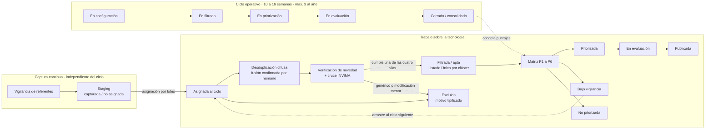
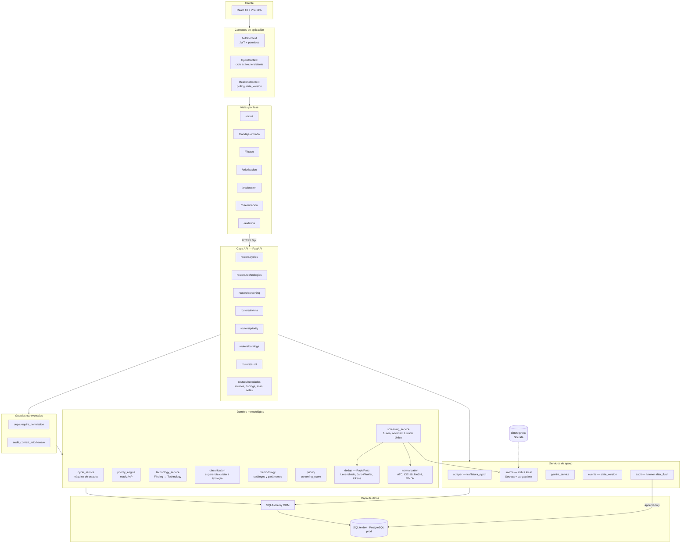
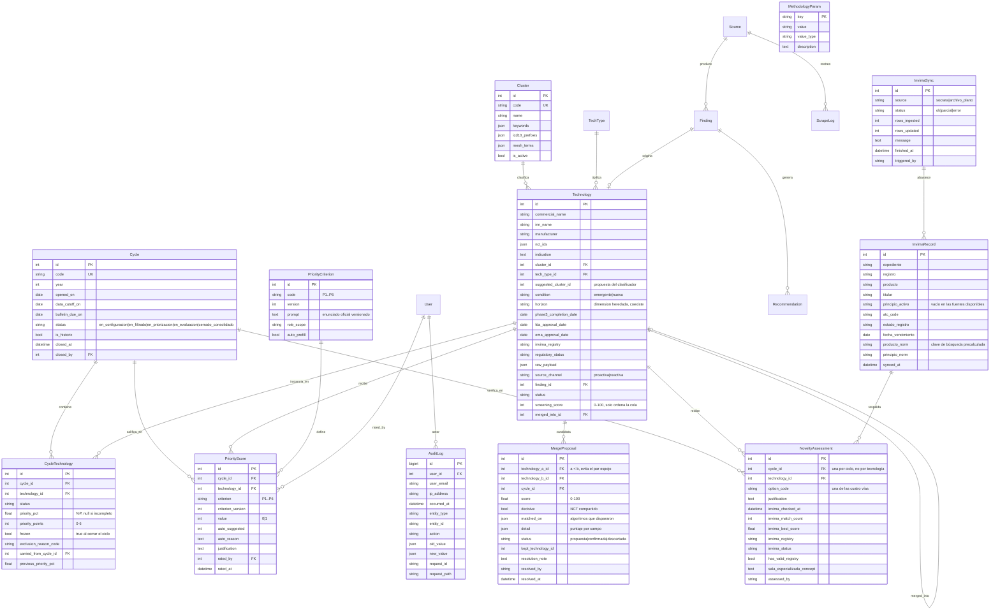
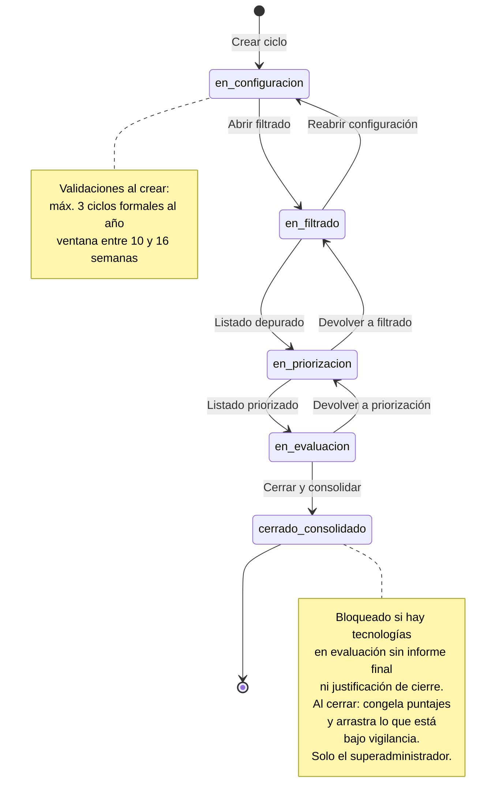
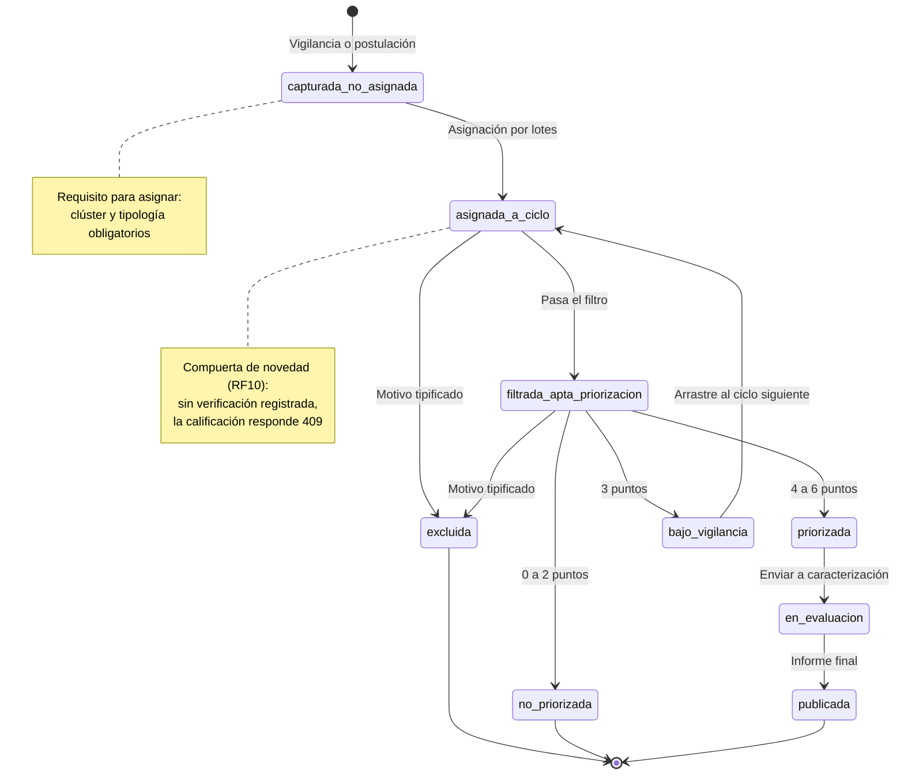
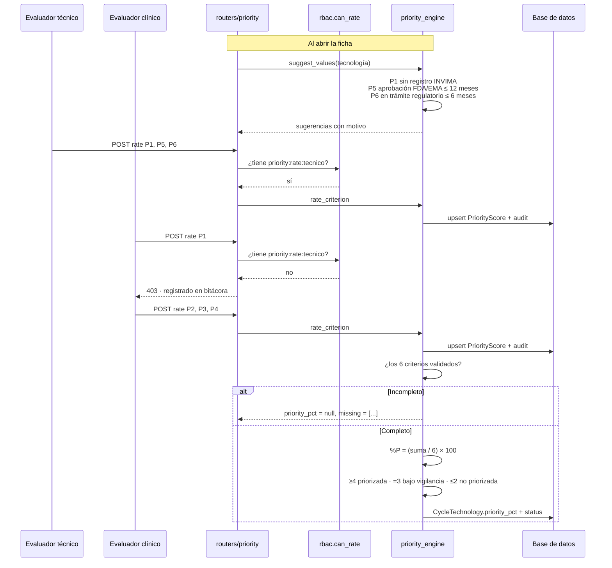
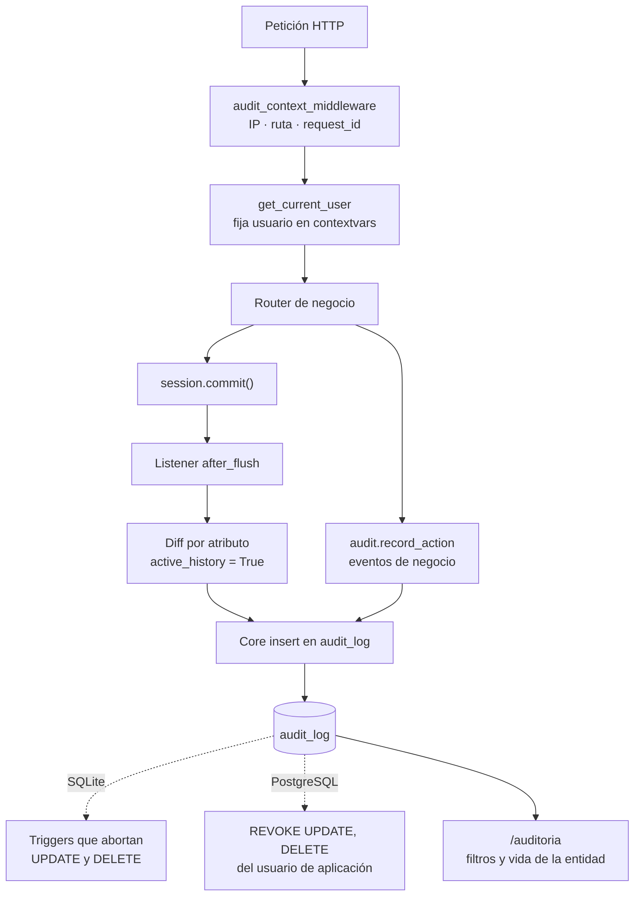
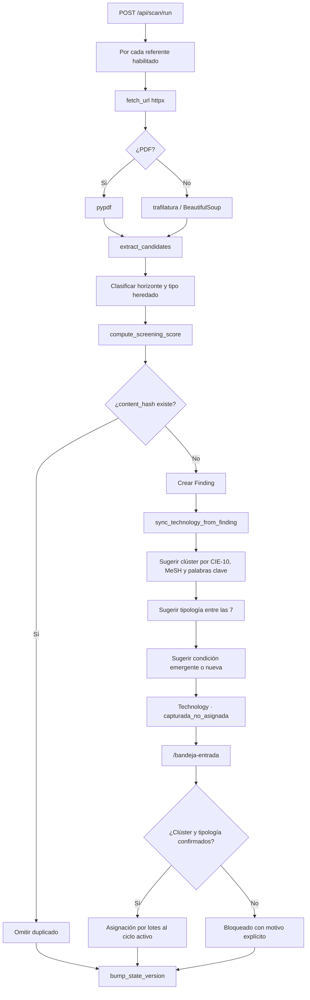
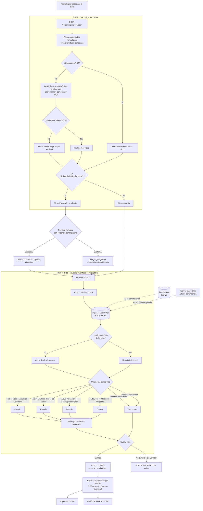
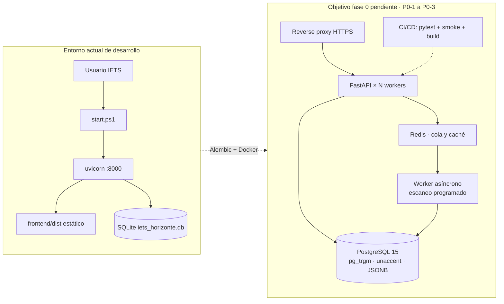

# Backlog — Plataforma de Escaneo de Horizonte del IETS

Documento vivo de producto, arquitectura y trazabilidad metodológica.
Ordenado según el [Plan de actualización por fases](Plan_Fases_Actualizacion_Plataforma_EH_IETS.md), cuya recomendación 5 exige mantener aquí el estado de cumplimiento de cada requerimiento funcional para que la trazabilidad ante entes de control esté siempre disponible.

**Versión del sistema:** v6.0.0 · **Fases cerradas:** 0, 1, 2, 3, 4, 5 y 6 · **Fase en curso:** 7

---

## Índice

1. [Estado del plan de fases](#estado-del-plan-de-fases)
2. [Matriz de trazabilidad de requerimientos](#matriz-de-trazabilidad-de-requerimientos)
3. [Qué cambió en v2.0](#qué-cambió-en-v20)
4. [Qué cambió en v3.0](#qué-cambió-en-v30)
4b. [Qué cambió en v4.0](#qué-cambió-en-v40)
4c. [Qué cambió en v5.0](#qué-cambió-en-v50)
5. [Diagrama: flujo metodológico por ciclo](#diagrama-flujo-metodológico-por-ciclo)
6. [Diagrama: arquitectura del sistema](#diagrama-arquitectura-del-sistema)
7. [Diagrama: modelo de datos](#diagrama-modelo-de-datos)
8. [Diagrama: máquina de estados del ciclo](#diagrama-máquina-de-estados-del-ciclo)
9. [Diagrama: máquina de estados de la tecnología](#diagrama-máquina-de-estados-de-la-tecnología)
10. [Diagrama: motor de priorización %P](#diagrama-motor-de-priorización-p)
11. [Diagrama: bitácora inmutable](#diagrama-bitácora-inmutable)
12. [Diagrama: pipeline de vigilancia y staging](#diagrama-pipeline-de-vigilancia-y-staging)
13. [Diagrama: filtrado, desduplicación y compuerta de novedad](#diagrama-filtrado-desduplicación-y-compuerta-de-novedad)
14. [Diagrama: despliegue](#diagrama-despliegue)
15. [Matriz RBAC de cinco perfiles](#matriz-rbac-de-cinco-perfiles)
16. [Mapa de módulos y rutas](#mapa-de-módulos-y-rutas)
17. [Superficie de API](#superficie-de-api)
18. [Parámetros metodológicos](#parámetros-metodológicos)
19. [Backlog priorizado](#backlog-priorizado)
20. [Decisiones de negocio abiertas](#decisiones-de-negocio-abiertas)
21. [Riesgos y deuda técnica](#riesgos-y-deuda-técnica)
22. [Criterios de éxito](#criterios-de-éxito)

---

## Estado del plan de fases

| Fase | Nombre | RF cubiertos | Estado | Evidencia |
|---|---|---|---|---|
| **0** | Fundaciones: auditoría, RBAC y regresión | RNF transversales | **Cerrada** (parcial en infraestructura) | `audit.py`, `rbac.py`, `smoke_test.py` |
| **1** | Ciclos, clústeres, tipologías y staging | RF03, RF04, RF05, RF06, RF07, RF08 | **Cerrada** | `cycle_service.py`, `methodology.py`, `/ciclos`, `/bandeja-entrada` |
| **2** | Motor oficial de priorización (%P) | Matriz P1–P6 (módulo 3) | **Cerrada** | `priority_engine.py`, `/priorizacion` |
| **3** | Filtrado, desduplicación difusa e INVIMA | RF09, RF10, RF11, RF12 | **Cerrada** (índice INVIMA con contingencia) | `dedup.py`, `invima.py`, `screening_service.py`, `/filtrado` |
| **4** | Ingesta ampliada: conectores y portal reactivo | RF01, RF02, RF03, RF04 | **Cerrada** (WHO ICTRP por lote; sin Celery/Redis) | `ingest/`, `ingest_service.py`, `/postular`, `/postulaciones` |
| **5** | Evaluación temprana, Mini-HTA y revisión por pares | RF13, RF14, RF15, RF16 | **Cerrada** (PDF por HTML/impresión; sin SMTP) | `evaluation_service.py`, `/evaluacion`, `/revisar/:token` |
| **6** | Dashboard estratégico, ficha pública, boletines | RF17, RF18, RF19, RF20 | **Cerrada** (sin SMTP; Recharts conservado) | `strategy_service.py`, `ttm.py`, `/dashboards`, `/expedientes`, `/boletines` |
| **7** | Endurecimiento e interoperabilidad | RNF de seguridad y disponibilidad | **Pendiente** | — |

### Detalle de lo pendiente en la fase 0

La fase 0 se cerró en su núcleo metodológico (bitácora, RBAC, regresión) pero deliberadamente **no** en su componente de infraestructura, porque exigía cambiar el entorno de despliegue de la institución y no era condición necesaria para las fases 1 y 2:

| Punto del plan | Estado | Nota |
|---|---|---|
| Bitácora inmutable `audit_log` append-only | Hecho | Listener `after_flush` + middleware. Triggers en SQLite, `REVOKE` en PostgreSQL |
| RBAC de cinco perfiles con permisos por módulo y por campo | Hecho | 20 permisos declarativos, granularidad P1–P6 |
| Ampliación de `smoke_test.py` a suite de regresión | Hecho | 68 verificaciones de extremo a extremo + 141 pruebas unitarias |
| Compatibilidad con PostgreSQL 15 (`pg_trgm`, `unaccent`, JSONB) | Hecho | `ensure_pg_extensions`, tipo `JSONType` portable. **Sin ejecutar en producción** |
| Alembic para migraciones versionadas | Pendiente (**P0-1**) | Hoy operan migraciones ligeras idempotentes en `database.py` |
| Docker, `docker-compose` y pipeline CI/CD | Pendiente (**P0-2**) | — |
| Separación formal de entornos y desactivación de `ALLOW_DEV_LOGIN` | Parcial (**P0-3**) | La bandera existe y el intento denegado ya queda en bitácora (`auth:dev_login_denied`); falta el perfil de entorno con secretos independientes |

---

## Matriz de trazabilidad de requerimientos

Estado real verificado contra el código en la fecha de esta actualización.

| RF | Requerimiento | Fase | Estado | Dónde está implementado |
|---|---|---|---|---|
| RF01 | Captura proactiva por APIs y conectores | 4 | **Hecho** | Adaptadores `clinicaltrials`, `fda`, `ema`, `pubmed`, `who_ictrp`; HTML como último recurso; cola `ingest_jobs` |
| RF02 | Portal web de postulación reactiva | 4 | **Hecho** | `/postular` público + cola de moderación en `/postulaciones`; COI bloqueante |
| RF03 | Staging data lake con `raw_payload` | 1 / 4 | **Hecho** | `raw_records` conserva el crudo por conector y `external_id`; reproceso sin volver a la fuente |
| RF04 | Buzón de entrada y previsualización | 1 / 4 | **Hecho** | Filtro por canal, preview del crudo y transferencia por lotes |
| RF05 | Parametrización del ciclo operativo | 1 | **Hecho** | `Cycle` + `cycle_service.py`: 3 ciclos/año, ventana 10–16 semanas |
| RF06 | Taxonomía de 6 clústeres de salud | 1 | **Hecho** | Tabla `clusters` con semilla parametrizable y sugerencia por CIE-10 y MeSH |
| RF07 | Clasificación por 7 tipologías tecnológicas | 1 | **Hecho** | Tabla `tech_types` con mapeo de los 4 tipos heredados |
| RF08 | Asignación de señales al ciclo activo | 1 | **Hecho** | `POST /api/technologies/assign-to-cycle`, rechaza lo no clasificado |
| RF09 | Desduplicación difusa | 3 | **Hecho** | `dedup.py` con Levenshtein, Jaro-Winkler y token sorting; propuesta con evidencia y confirmación humana |
| RF10 | Criterio de novedad e innovación | 3 | **Hecho** | Cuatro vías en `NoveltyAssessment`, compuerta que bloquea el paso a priorización |
| RF11 | Verificación regulatoria INVIMA | 3 | **Hecho (con contingencia)** | Índice local sincronizado desde datos.gov.co y por archivo plano; alerta a los 30 días |
| RF12 | Listado Único depurado por clúster | 3 | **Hecho** | `GET /api/screening/unique-list/{ciclo}` y exportación CSV |
| RF13 | Editor de fichas de tecnologías | 5 | **Hecho** | Ficha estructurada RF13 con completitud exigible; `/evaluacion` |
| RF14 | Editor Mini-HTA con PICO | 5 | **Hecho** | PICO + impacto 1–3 años + incertidumbre; nivel sugerido por puntos (D-07/D-09) |
| RF15 | Workflow de revisión por pares | 5 | **Hecho** | Seis estados editoriales, versionado mayor/menor, comentarios en línea |
| RF16 | Portal de revisores y conflicto de interés | 5 | **Hecho** | `/revisar/:token` JWT 10 días; COI bloqueante interno y externo |
| RF17 | Dashboard de gobernanza anticipatoria | 6 | **Hecho** | Cuatro visualizaciones, filtros, TTM parametrizado (D-10), datamart al cierre |
| RF18 | Ficha pública y consulta rápida | 6 | **Hecho** | `/expedientes` y `/api/public/technologies`; oculta presupuesto y confidenciales |
| RF19 | Boletines trimestrales automatizados | 6 | **Hecho** | Compilación al cierre; no se publica sin aprobación del líder |
| RF20 | Alertas tempranas | 6 | **Hecho** | Suscripción por clúster; in-app. Correo pendiente de SMTP |

**Módulo 3 (matriz P1–P6):** la especificación no le asignó RF numerados, pero es el núcleo metodológico y está **implementado por completo**. La inconsistencia 4 del plan sigue vigente: se recomienda que la versión 2 de la especificación numere estos requerimientos.

---

## Qué cambió en v2.0

### El ciclo pasó a ser el eje

Antes, una señal (`Finding`) era la unidad de trabajo y su estado vivía en ella misma. Ahora la unidad metodológica es la **tecnología**, que persiste entre ciclos, y su estado y sus puntajes viven en la **instancia por ciclo** (`cycle_technology`). Esto es lo que permite que una tecnología se evalúe en el Ciclo I, quede bajo vigilancia, se arrastre al Ciclo II y se reevalúe sin sobrescribir el registro anterior.

Ningún dato se descartó: cada `Finding` existente se convirtió en una `Technology`, y las señales ya trabajadas se asociaron a un **Ciclo 0 - Histórico** cerrado, que nunca contamina los indicadores de los ciclos formales.

### La priorización dejó de ser una heurística

El antiguo `priority_score` (0–100, umbral 70%) se renombró a **`screening_score`** y quedó confinado a ordenar la cola de señales aún no calificadas. Ya no gobierna transiciones de estado ni se muestra como puntaje de priorización.

Su reemplazo es la **matriz oficial P1–P6**: seis criterios binarios, `%P = (suma / 6) × 100`, con enunciados versionados en base de datos y clasificación en tres franjas. El `%P` no se calcula ni se muestra mientras falte un criterio.

### La metodología se configura, no se despliega

Clústeres, tipologías, enunciados P1–P6 y umbrales viven en base de datos y se editan desde `/configuracion`, en la pestaña de gobierno metodológico. La coordinación metodológica puede ajustar un umbral o retirar un clúster sin abrir un ticket de desarrollo, y cada cambio queda fechado y atribuido en la bitácora.

### La auditoría precede a todo

Cada creación, modificación y borrado sobre las entidades sensibles queda registrado con usuario, correo, IP, ruta, identificador de petición, valor anterior y valor nuevo. El registro se hace en un listener `after_flush` de SQLAlchemy más un middleware de contexto, de modo que ningún camino de código puede saltárselo, y la tabla se protege a nivel de motor.

---

## Qué cambió en v3.0

### Entre la bandeja y la matriz ahora hay un filtro

La v2.0 pasaba directo de asignar una señal al ciclo a calificarla con P1–P6. La v3.0 interpone el módulo 2 completo en `/filtrado`: se depuran duplicados, se verifica que la tecnología sea realmente nueva para el país y se consolida el Listado Único por clúster.

### El duplicado que importa no es el exacto

El hash de contenido solo detecta la misma página traída dos veces. La misma tecnología llega con nombres distintos según la fuente —"Keytruda 100 mg", "pembrolizumab", una errata de transcripción— y ese es el duplicado que contamina el Listado Único.

`dedup.py` normaliza el nombre a su núcleo identificable (sin tildes, dosis, forma farmacéutica ni sal) y lo compara con los tres algoritmos que pide la especificación. **Los tres se conservan por separado**, no colapsados en un número, porque quien debe confirmar la fusión necesita ver por qué se propuso:

| Señal | Tratamiento | Motivo |
|---|---|---|
| Identificador NCT compartido | Decisiva, no pasa por el umbral | Compartir un ensayo no es parecerse: es ser el mismo desarrollo |
| Nombre comercial y DCI, cruzados | Mezcla ponderada: token sorting 0,40 · Jaro-Winkler 0,35 · Levenshtein 0,25 | Las fuentes no son consistentes en cuál de los dos campos ponen la marca |
| Fabricante | `token_set_ratio`; solo mueve el puntaje en los extremos | Ver la calibración abajo |
| Código ATC idéntico | +3 puntos | Refuerza, no decide: el ATC agrupa familias, no productos |

**Ninguna fusión es automática.** El sistema propone, una persona confirma, y el registro absorbido nunca se borra: queda apuntando al que se conserva con `merged_into_id`, porque la trazabilidad de la captura original es parte del expediente. Antes de marcarlo, la fusión traslada al superviviente los datos que solo tenía el duplicado (NCT, ATC, fechas de aprobación), de modo que depurar no pierda información.

#### Por qué el fabricante casi no pesa

La intuición dice que dos laboratorios distintos descartan la fusión. Medido sobre razones sociales reales, la intuición no se sostiene:

| Par | `token_set_ratio` | Realidad |
|---|---|---|
| MSD / MSD Colombia SA | 100 | Misma casa |
| Novo Nordisk / Novo Nordisk Colombia | 100 | Misma casa |
| Janssen Cilag / Johnson y Johnson | 40 | Distintas |
| Laboratorios Andinos / Pharma Global | 36 | Distintas |
| **Merck Sharp Dohme / MSD Colombia** | **34** | **Misma casa, por sigla** |
| Bayer / Sanofi Aventis | 21 | Distintas |
| Roche / Pfizer | 18 | Distintas |

Una sigla y su desarrollo puntúan igual que dos empresas sin relación, y ninguna métrica de cadenas resuelve eso. Por tanto el fabricante **solo mueve el puntaje en los extremos** (≥85 refuerza, <25 penaliza) y calla en la franja intermedia, en vez de inventar una conclusión. Hay una prueba unitaria dedicada a que siga callando.

### Nada avanza sin decir por qué es nuevo

`qualify_for_prioritization` dejó de ser un cambio de estado libre. Ahora hay una compuerta, `novelty_gate`, que exige tres cosas antes de dejar pasar una tecnología a la matriz:

1. Que se haya cruzado con el índice del INVIMA, con fecha.
2. Que se haya declarado una de las cuatro vías de novedad.
3. Que, si la vía elegida lo requiere, exista justificación explícita.

Y una prohibición: **una tecnología con registro sanitario vigente no puede declararse "no disponible en el país"**. Si el índice reporta registro, hay que sustentar nueva indicación, nueva forma farmacéutica disruptiva o nueva combinación. Es el criterio de aceptación textual de la fase 3 y tiene su prueba unitaria.

### El filtro regulatorio vive en casa

El plan advertía que el acceso al dato del INVIMA no está garantizado. La implementación toma esa advertencia en serio: la verificación **nunca** consulta el servicio en línea, sino un índice local, con dos rutas de alimentación equivalentes en el modelo de datos.

Al implementar se comprobó contra la fuente real, y la advertencia era exacta:

| Conjunto de datos.gov.co | Estado verificado |
|---|---|
| `ui32-p9f2` · Registros sanitarios y NSO | Responde con datos |
| `y4qt-w6tk` · Dispositivos médicos | Responde con datos (con la errata `prodcuto` en el origen) |
| `i7cb-raxc` · Código Único de Medicamentos vigentes | **HTTP 200 con cero filas** |

Por eso el conector sincroniza **varios conjuntos** y un conjunto caído no cancela a los demás. El CUM permanece en la lista para que el índice lo recoja apenas la entidad lo republique. La primera sincronización real trajo 3.332 registros.

**Limitación conocida:** ningún conjunto disponible expone el principio activo, solo el nombre del producto. La verificación por DCI queda degradada hasta que el CUM vuelva a publicar o se acuerde la ruta estructurada (decisión **D-04**).

La antigüedad del índice es un dato de primera clase y se muestra en pantalla: un filtro regulatorio desactualizado no falla, da falsos negativos en silencio, que es peor.

#### Rendimiento medido, no supuesto

La especificación exige respuesta por debajo de 100 ms en el percentil 95. El prefiltro usa `LIKE '%término%'`, que no puede aprovechar un índice B-tree, así que se midió a escala realista con `bench_invima.py`:

| Volumen del índice | Mediana | p95 | Veredicto |
|---|---|---|---|
| 3.332 registros (sincronización real) | 4,5 ms | 7,0 ms | Cumple |
| 300.000 registros (escala del índice completo) | 10,0 ms | **76,5 ms** | Cumple, con poco margen |

Cumple, pero el margen a escala completa es estrecho. `pg_trgm` sobre PostgreSQL —la mitad de infraestructura que la fase 0 dejó pendiente— es el plan de holgura, no un adorno.

### El parámetro muerto volvió con dueño

`dedup.similarity_threshold` se había retirado en v2.0 por ser una perilla sin efecto. Vuelve ahora porque ya tiene consumidor real, junto con `invima.match_threshold`. La prueba `test_every_seeded_parameter_has_a_consumer` ahora recorre el paquete completo en vez de una lista fija de archivos, para que un módulo nuevo no la invalide en silencio.

---

## Qué cambió en v4.0

La captura dejó de ser un rastreo HTML que bloqueaba la petición. Cada fuente declara un **adaptador** (`clinicaltrials`, `fda`, `ema`, `pubmed`, `who_ictrp` o `html`). El trabajo vive en `ingest_jobs`: si el proceso muere a mitad de una corrida, al reiniciar se sabe qué quedó a medias. Un conector caído abre su propio cortacircuitos; los demás siguen.

El crudo se guarda en `raw_records` con `(connector, external_id)`. Si mañana cambia el mapeo, se reprocesa desde ahí. El portal `/postular` recibe postulaciones externas; sin declaración de conflicto de interés no se guardan, y sin moderación no entran al staging.

La cola no depende de Redis: un hilo del proceso la recorre. El día que se adopte Celery, `run_job` se reutiliza.

---

## Qué cambió en v5.0

`/caracterizacion` dejó de ser un checklist sobre `Finding`. Cada tecnología priorizada abre un `EvaluationDoc` con tres niveles de producto (ficha, informe, Mini-HTA). El nivel se **sugiere** con `evaluation.mini_hta_min_points` y `evaluation.informe_min_points` y se puede sobreescribir: D-07 y D-09 siguen abiertas.

Seis estados editoriales, auditados. Sin COI firmado no hay cuerpo, ni para el evaluador interno. El revisor externo entra con JWT de 10 días, sin cuenta; el token caducado se niega y el intento queda en bitácora. No se publica sin un interno y un externo con COI. El cierre del ciclo acepta el informe publicado como producto final.

El PDF institucional se entrega como HTML/CSS imprimible (WeasyPrint es frágil en Windows). No hay SMTP: el enlace de invitación se copia una vez.

---

## Qué cambió en v6.0

El tablero de `/dashboards` pasó a ser el de gobernanza: filtros, distribución por clúster, dispersión de time-to-market, embudo del ciclo y mapa de calor presupuestal. Este último, y los comparadores del SGSSS, solo viajan si el perfil tiene `analytics:restricted`. La vista `/transparencia` y `/api/public/strategy/stats` no los incluyen.

El TTM se calcula desde fase III más `ttm.regulatory_review_days` (o desde la aprobación de agencia) y se versiona por ciclo al cerrar. Las franjas son dato (D-10). Al cerrar también se refresca el datamart y se deja un boletín en `pendiente_aprobacion`; no se publica sin el visto del líder.

`/expedientes` lista solo fichas `publicado` y no confidenciales, sin presupuestos. Las alertas viven en `/alertas` (in-app). Recharts se conserva (D-11).

---

## Diagrama: flujo metodológico por ciclo

---

## Diagrama: arquitectura del sistema

---

## Diagrama: modelo de datos

**Restricción clave:** `PriorityScore` es único por `(cycle_id, technology_id, criterion)`. Recalificar en un ciclo posterior crea filas nuevas; nunca modifica las congeladas.

---

## Diagrama: máquina de estados del ciclo

---

## Diagrama: máquina de estados de la tecnología

---

## Diagrama: motor de priorización %P

**Franjas de clasificación** (parámetros `priority.points_prioritized` y `priority.points_watch`, editables en base de datos):

| Puntos | %P | Clasificación |
|:---:|:---:|---|
| 6 | 100,00 | Priorizada |
| 5 | 83,33 | Priorizada |
| 4 | 66,67 | Priorizada |
| 3 | 50,00 | Bajo vigilancia |
| 2 | 33,33 | No priorizada |
| 1 | 16,67 | No priorizada |
| 0 | 0,00 | No priorizada |

La regla vigente es **por conteo de puntos**, según la recomendación del plan frente a la contradicción del Manual entre `%P ≥ 70%` y `4 a 6 puntos` (decisión **D-02**, abierta). El porcentaje se muestra como etiqueta, no como umbral.

---

## Diagrama: bitácora inmutable

**Entidades auditadas automáticamente** (altas, cambios y bajas, con valor anterior y nuevo): `users`, `sources`, `findings`, `technologies`, `cycles`, `cycle_technologies`, `priority_scores`, `priority_criteria`, `clusters`, `tech_types`, `methodology_params`, `recommendations`.

**Campos nunca copiados a la bitácora,** por ruido o por ser dato sensible: `raw_content`, `raw_payload`, `picture`.

**Atribución al usuario real.** Un registro que dice `sistema` no sirve ante una auditoría, y conseguir el nombre correcto tiene una sutileza. El middleware corre en la tarea de la petición, pero las dependencias y los endpoints declarados con `def` se ejecutan en hilos del *threadpool*, cada uno con una **copia** del contexto: un `ContextVar.set()` hecho dentro de esa copia no vuelve al padre ni alcanza a las demás. Como las copias comparten la *referencia* al mismo diccionario, el middleware reserva el contenedor antes de enrutar y `get_current_user` lo completa en sitio. Así la autenticación sigue resolviéndose en un único lugar, sin duplicar el descifrado del token. El inicio de sesión se atribuye igual, porque el alta del perfil ocurre antes de que exista un principal autenticado. Hay dos pruebas unitarias que reproducen el escenario de los hilos y una verificación de la suite que rechaza cualquier escritura anónima de la corrida.

**Eventos de negocio que no se reducen a un cambio de fila** y se registran aparte:

| Acción | Qué documenta |
|---|---|
| `cycle:transition` | Cambio de estado del ciclo, con el estado anterior |
| `cycle:close` | Cierre, número de puntajes congelados, si fue forzado y con qué justificación |
| `cycle:carry_over` | Arrastre entre ciclos, con origen y cantidad |
| `priority:classify` | Clasificación resultante al completarse los seis criterios |
| `staging:assign_batch` | Asignación por lotes, con aceptados y rechazados |
| `auth:dev_login_denied` | Intento de usar el acceso de desarrollo estando deshabilitado |

---

## Diagrama: pipeline de vigilancia y staging

---

## Diagrama: filtrado, desduplicación y compuerta de novedad

El módulo se interpone entre la asignación al ciclo y la matriz `%P`. Nada avanza sin pasar por él, y ninguna de sus tres decisiones se toma sin una persona.

---

## Diagrama: despliegue

El código ya es **agnóstico del motor**: `JSONType` resuelve a JSONB en PostgreSQL y a JSON en SQLite, `ensure_pg_extensions` habilita `pg_trgm` y `unaccent`, y el endurecimiento de la bitácora aplica la estrategia que corresponde a cada motor. Lo que falta es la operación de migración, no la compatibilidad.

---

## Matriz RBAC de cinco perfiles

Los permisos son declarativos y se conceden por módulo; en la matriz de priorización, además, por criterio.

| Permiso | Superadmin | Eval. técnico | Eval. clínico | Tomador decisiones | Revisor pares |
|---|:---:|:---:|:---:|:---:|:---:|
| `read` — consultar el sistema | ✓ | ✓ | ✓ | ✓ | ✓ |
| `source:write` — inventario de referentes | ✓ | ✓ | ✓ | | |
| `scan:run` — ejecutar vigilancia | ✓ | ✓ | ✓ | | |
| `staging:assign` — asignar al ciclo | ✓ | ✓ | ✓ | | |
| `technology:write` — editar tecnología | ✓ | ✓ | ✓ | | |
| `screening:write` — filtrar, fusionar, excluir, verificar novedad | ✓ | ✓ | ✓ | | |
| `invima:sync` — sincronizar el índice regulatorio | ✓ | ✓ | | | |
| `cycle:write` — crear y transicionar ciclos | ✓ | ✓ | | | |
| `cycle:close` — cerrar y consolidar | ✓ | | | | |
| `catalog:write` — clústeres, tipologías, parámetros | ✓ | | | | |
| `priority:rate:tecnico` — **P1, P5, P6** | ✓ | ✓ | | | |
| `priority:rate:clinico` — **P2, P3** | ✓ | | ✓ | | |
| `priority:rate:p4` — **P4** | ✓ | | ✓ | | |
| `report:write` — informes y caracterización | ✓ | ✓ | ✓ | | |
| `review:submit` — revisión por pares (fase 5) | ✓ | | | | ✓ |
| `note:write` — notas del equipo | ✓ | ✓ | ✓ | ✓ | |
| `audit:read` — bitácora | ✓ | | | | |
| `user:manage` — gestión de usuarios | ✓ | | | | |
| `config:manage` — configuración institucional | ✓ | | | | |
| `analytics:restricted` — tableros de decisión | ✓ | | | ✓ | |

**Migración de roles heredados**, aplicada automáticamente al arrancar: `admin → superadmin`, `editor → evaluador_tecnico`, `viewer → tomador_decisiones`. Los perfiles `evaluador_clinico` y `revisor_pares` requieren alta manual, tal como prevé el plan.

**P4 está asignado al evaluador clínico** mediante un permiso propio (`priority:rate:p4`), separable sin cambiar código el día que se cierre la decisión **D-03**. Las Tablas 2 y 3 de la especificación lo asignan al clínico; la guía técnica del numeral 3.4.2 lo asigna al perfil farmacéutico o biomédico.

---

## Mapa de módulos y rutas

| Módulo | Ruta | Fase | Permiso | Entidades |
|---|---|---|---|---|
| Bandeja de trabajo | `/` | Operación | `read` | Indicadores por ciclo |
| **Ciclos** | `/ciclos` | 1 | `read` / `cycle:write` | `Cycle`, `CycleTechnology` |
| **Bandeja de entrada** | `/bandeja-entrada` | 1 | `read` / `staging:assign` | `Technology` sin asignar |
| Vigilancia | `/vigilancia` | 1 | `read` / `scan:run` | `Source`, `ScrapeLog` |
| Inventario | `/fuentes` | 1 | `read` / `source:write` | `Source` |
| **Filtrado y depuración** | `/filtrado` | 3 | `read` / `screening:write` / `invima:sync` | `MergeProposal`, `NoveltyAssessment`, `InvimaRecord` |
| **Priorización oficial %P** | `/priorizacion` | 2 | `read` / `priority:rate:*` | `PriorityScore`, `CycleTechnology` |
| Señales (cola de cribado) | `/senales` | 1–2 | `read` | `Finding`, `screening_score` |
| **Evaluación temprana** | `/evaluacion` | 5 | `read` / `report:write` | `EvaluationDoc` |
| **Revisión por pares** | `/revisar/:token` | 5 | Público (token) | `ReviewAssignment` |
| Diseminación | `/diseminacion` | 4 | `read` / `report:write` | `Recommendation` |
| Notas | `/notas` | 4 | `read` / `note:write` | `Note` |
| Indicadores | `/dashboards` | Análisis | `read` | Agregados por ciclo |
| Asistente IA | `/chat` | Análisis | `read` | `ChatSession` |
| **Auditoría** | `/auditoria` | 0 | `audit:read` | `AuditLog` |
| Usuarios y perfiles | `/usuarios` | Admin | `user:manage` | `User` |
| Configuración | `/configuracion` | Admin | `config:manage` | Gobierno metodológico (parámetros, catálogos, matriz) y Gemini |

**Rutas legacy con redirección permanente:** `/escaneo → /vigilancia`, `/hallazgos → /senales`, `/recomendaciones → /diseminacion`, `/caracterizacion → /evaluacion`. La antigua `/priorizacion` (lista de señales por heurística) se movió a `/senales`; la ruta liberada la ocupa ahora la matriz oficial %P.

---

## Superficie de API

### Nueva en v2.0

| Método y ruta | Propósito |
|---|---|
| `GET /api/cycles` · `POST` · `PUT /{id}` | CRUD de ciclos con validación de cuota anual y ventana |
| `GET /api/cycles/active` | Ciclo formal abierto más reciente |
| `GET /api/cycles/{id}/close-check` | Bloqueos vigentes antes de cerrar |
| `PUT /api/cycles/{id}/status` | Transición validada contra la máquina de estados |
| `POST /api/cycles/{id}/carry-over` | Arrastre de lo que quedó bajo vigilancia |
| `GET /api/technologies/staging` · `/staging/stats` | Buzón de entrada y su tablero |
| `POST /api/technologies/assign-to-cycle` | Asignación por lotes con rechazos justificados |
| `POST /api/technologies/{id}/suggest-classification` | Sugerencia de clúster, tipología y condición |
| `POST /api/technologies/{id}/cycles/{cid}/qualify` · `/exclude` · `/to-evaluation` | Filtrado del listado único |
| `GET /api/priority/criteria` | Enunciados P1–P6 versionados |
| `GET /api/priority/{cid}/{tid}` · `POST .../rate` | Estado y calificación de la matriz |
| `GET /api/priority/{cid}/queue` · `/stats` | Cola de calificación y métricas del ciclo |
| `GET /api/clusters` · `/tech-types` (+ `POST`, `PUT`) | Catálogos parametrizables |
| `GET /api/methodology/params` · `PUT /{key}` | Parámetros metodológicos en caliente |
| `GET /api/methodology/enums` | Contrato único de estados y etiquetas |
| `GET /api/audit` · `/entity/{tipo}/{id}` · `/actions` | Bitácora inmutable |
| `GET /api/users/roles` | Catálogo de perfiles con sus permisos |

### Nueva en v3.0

| Método y ruta | Propósito |
|---|---|
| `POST /api/screening/merges/scan` | Barrido difuso; deja propuestas pendientes de revisión |
| `GET /api/screening/merges` | Propuestas con su evidencia por algoritmo |
| `POST /api/screening/merges/{id}/confirm` · `/discard` | Resolución humana de la fusión |
| `GET /api/screening/novelty/options` | Las cuatro vías del criterio de novedad |
| `GET /api/screening/novelty/{cid}/{tid}` · `PUT` | Estado y registro de la verificación |
| `POST /api/screening/novelty/{cid}/{tid}/invima-check` | Cruce con el índice regulatorio, fechado |
| `POST /api/screening/normalize/{id}` | Canoniza ATC, CIE-10, MeSH y nomenclatura de dispositivos |
| `GET /api/screening/unique-list/{cid}` · `/export` | Listado Único por clúster y su exportación CSV |
| `GET /api/screening/stats` | Embudo de depuración del ciclo |
| `GET /api/invima/status` · `/syncs` · `/search` | Estado, historial y consulta del índice local |
| `POST /api/invima/sync` · `/sync/file` | Sincronización desde datos.gov.co y ruta de contingencia |

### Nueva en v4.0

| Método y ruta | Propósito |
|---|---|
| `GET /api/ingest/connectors` | Adaptadores registrados y el rastreador HTML |
| `POST /api/ingest/run` · `/tick` | Encolar fuentes y procesar la cola |
| `GET /api/ingest/jobs` · `/raw/{tid}` | Estado de la cola y preview del crudo |
| `POST /api/public/submissions` | Portal público (sin cuenta institucional) |
| `GET /api/submissions` · `POST .../accept` · `/reject` | Moderación del canal reactivo |

### Nueva en v5.0

| Método y ruta | Propósito |
|---|---|
| `GET /api/reports?cycle_id=` | Cola de evaluación del ciclo |
| `POST /api/reports` | Abre el expediente (nivel sugerido o forzado) |
| `GET` · `PUT /api/reports/{id}` | Lectura/edición; el cuerpo se omite sin COI |
| `POST /api/reports/{id}/coi` | Declaración de conflicto de interés del evaluador interno |
| `POST /api/reports/{id}/transition` | Transición editorial auditada |
| `POST /api/reports/{id}/invite` | Invita revisor; el token externo se devuelve una vez |
| `GET /api/reports/{id}/versions` · `POST .../comments` · `GET .../export` | Historial, observaciones y HTML institucional |
| `GET /api/public/reviews/{token}` | Portal del revisor; 401 si expiró, cuerpo omitido sin COI |
| `POST /api/public/reviews/{token}/coi` · `/comments` · `/submit` | COI, observaciones y veredicto |

### Cambios sobre la API existente

- `Finding.priority_score` → **`Finding.screening_score`** en todas las respuestas. La migración renombra la columna preservando los datos.
- `UserOut` incorpora `role_label`, `permissions` y `rateable_criteria`, de modo que el frontend no reimplementa la matriz de autorización.
- `require_role` se conserva como envoltorio de compatibilidad sobre `require_permission`.

---

## Parámetros metodológicos

Los parámetros son editables desde `/configuracion` o `PUT /api/methodology/params/{key}` sin desplegar. Todo cambio queda en la bitácora.

| Clave | Defecto | Gobierna |
|---|:---:|---|
| `cycle.max_per_year` | 3 | Ciclos formales por año calendario |
| `cycle.window_weeks_min` | 10 | Duración mínima de la ventana operativa, en semanas |
| `cycle.window_weeks_max` | 16 | Duración máxima de la ventana operativa, en semanas |
| `priority.points_prioritized` | 4 | Puntos mínimos para clasificar como priorizada |
| `priority.points_watch` | 3 | Puntos exactos para quedar bajo vigilancia |
| `priority.criteria_total` | 6 | Denominador del `%P`. Cambia solo si el Manual añade criterios |
| `priority.threshold_pct_label` | 70 | Porcentaje de referencia que se muestra en la interfaz, sin efecto sobre la clasificación (decisión **D-02**) |
| `dedup.similarity_threshold` | 85 | Similitud mínima para proponer una fusión. Bajarlo propone más y exige más revisión humana |
| `invima.match_threshold` | 88 | Similitud mínima para dar por hallado un registro sanitario en el índice local |
| `evaluation.mini_hta_min_points` | 6 | Puntos mínimos para sugerir Mini-HTA (D-07/D-09) |
| `evaluation.informe_min_points` | 5 | Puntos mínimos para sugerir informe; por debajo, ficha |
| `evaluation.reviewer_token_days` | 10 | Vigencia del JWT del revisor externo (RF16) |

**Cada perilla mueve algo.** Un parámetro editable que ningún cálculo lee es peor que no tenerlo: invita a ajustarlo y a creer que surtió efecto. Por eso `screening.queue_threshold` se retiró del catálogo y la migración lo elimina de las bases existentes: el destaque en la cola de cribado es una ayuda visual y vive como constante compartida entre backend y frontend. `dedup.similarity_threshold` se había retirado por el mismo motivo y **volvió en v3.0 con consumidor real**.

La prueba `test_every_seeded_parameter_has_a_consumer` recorre el paquete completo y falla si alguna clave sembrada no aparece en el código, de modo que la regla se sostiene sola.

Los **enunciados de P1 a P6 también son datos**, no literales: viven en `priority_criteria` con número de versión, de modo que un ajuste del Manual Metodológico no obliga a un despliegue y las calificaciones antiguas conservan la versión del enunciado bajo el que se emitieron.

---

## Backlog priorizado

### P0 — Cierre de la fase 0 (infraestructura)

| ID | Área | Item | Problema | Solución | Esfuerzo |
|---|---|---|---|---|---|
| P0-1 | Infra | Alembic + PostgreSQL 15 | Las migraciones ligeras no son versionadas ni reversibles | Baseline Alembic sobre el esquema actual, ensayo de migración con conteos de control y ventana de retorno a SQLite | L |
| P0-2 | DevOps | Docker Compose + CI/CD | Despliegue manual, sin pruebas obligatorias en merge | `api`, `worker`, `postgres`, `redis` + pipeline con pytest, suite de regresión y build | L |
| P0-3 | Seguridad | Separación de entornos | `ALLOW_DEV_LOGIN` convive con la configuración productiva | Perfil por entorno (`development`, `testing`, `production`) con secretos independientes y valores por defecto seguros | M |
| P0-4 | Vigilancia | Escaneo programado | La captura sigue siendo manual | Worker con cron sobre Redis + alertas en la bandeja de entrada | L |

### P1 — Cierre pendiente de la fase 3

Los cuatro RF de la fase están entregados. Queda lo que depende de gestión institucional o de la infraestructura de la fase 0:

| ID | RF | Item | Problema | Solución | Esfuerzo |
|---|---|---|---|---|---|
| P1-1 | RF11 | Actas de la Sala Especializada | El concepto se transcribe a mano en un campo de texto | Extracción asistida del acta en PDF con enlace al documento original | M |
| P1-2 | RF11 | Principio activo en el índice | Los conjuntos abiertos disponibles solo exponen el nombre del producto, así que el cruce por DCI queda degradado | Reclamar la republicación del CUM ante el INVIMA (**D-04**) o acordar la ruta estructurada | M |
| P1-3 | RF09 | Similitud en el motor de base de datos | El prefiltro `LIKE '%…%'` no usa índice; a 300.000 registros el p95 queda en 76 ms, con poco margen | `pg_trgm` con índice GIN una vez ejecutada la migración a PostgreSQL (**P0-1**) | M |
| P1-4 | RF09 | Barrido programado | El barrido difuso se dispara a mano desde la pantalla | Tarea periódica en el worker de **P0-4**, con aviso en la bandeja al aparecer propuestas | S |

### P2 — Cierre pendiente de la fase 4

Los cuatro RF de la fase están entregados. Queda lo que depende de infraestructura o de gestión:

| ID | RF | Item | Problema | Solución | Esfuerzo |
|---|---|---|---|---|---|
| P2-1 | RF01 | Cola externa Celery + Redis | El worker vive en el mismo proceso que la API | Extraer `run_job` a un worker Celery cuando exista Redis institucional (**P0-2**) | M |
| P2-2 | RF01 | WHO ICTRP en vivo | El portal de la OMS no garantiza REST | Acordar espejo JSON o lote periódico (**D-06**) | M |
| P2-3 | RF02 | reCAPTCHA en producción | Sin clave, el portal omite la verificación anti-robot | Configurar `RECAPTCHA_SECRET` y `RECAPTCHA_SITE_KEY` | S |

### P3 — Cierre pendiente de la fase 5

Los cuatro RF de la fase están entregados. Queda lo que depende de infraestructura o de gestión:

| ID | RF | Item | Problema | Solución | Esfuerzo |
|---|---|---|---|---|---|
| P3-1 | RF13 | Editor enriquecido TipTap | El cuerpo es formulario estructurado, no ProseMirror | Adoptar TipTap cuando haya tiempo de UX | M |
| P3-2 | RF16 | Envío de correo | No hay SMTP institucional; el enlace se copia | Conectar el token al correo cuando exista el canal | S |
| P3-3 | RF13 | PDF nativo WeasyPrint/Playwright | En Windows WeasyPrint es frágil; hoy se exporta HTML institucional | Renderizar PDF en el entorno Linux de despliegue | M |

### P4 — Cierre pendiente de la fase 6

| ID | RF | Item | Problema | Solución | Esfuerzo |
|---|---|---|---|---|---|
| P4-1 | RF19 | PDF nativo del boletín | Hoy se exporta HTML ejecutivo | Playwright/WeasyPrint en el entorno Linux | M |
| P4-2 | RF20 | Correo de alertas | No hay SMTP institucional | Conectar el canal cuando exista | S |

### P5 — Transversales y mejora continua

| ID | Área | Item | Solución | Esfuerzo |
|---|---|---|---|---|
| P5-1 | QA | Tests E2E Playwright | Recorrido completo de un ciclo, de la captura al cierre | L |
| P5-2 | UX | Paginación de la cola | La priorización se degrada con más de 200 tecnologías | M |
| P5-3 | UX | Tour guiado por fases | Onboarding sin documentación externa | M |
| P5-4 | Export | Paquete de diseminación | ZIP con informes, notas y listado único del ciclo | M |
| P5-5 | A11y | WCAG AA | Auditoría axe sobre las vistas nuevas | M |
| P5-6 | Mobile | Tablas responsive | Vista de tarjetas por debajo de 768 px | M |
| P5-7 | IA | Modelo por tarea | Flash para cribado, Pro para informes | M |
| P5-8 | IA | Chat con embeddings | RAG sobre `pgvector` en lugar de recuperación simple | L |
| P5-9 | Notificaciones | Centro de actividad | Escaneos, menciones y vencimientos del ciclo | L |
| P5-10 | i18n | Interfaz bilingüe | Los referentes publican en inglés | L |

**Esfuerzo:** S = 1–2 días · M = 3–5 días · L = 1–2 semanas · XL = más de 2 semanas

---

## Decisiones de negocio abiertas

Bloquean fases futuras. Ninguna se resolvió por supuesto del equipo de desarrollo: donde había ambigüedad, se implementó la lectura recomendada por el plan y se dejó parametrizada para revertir sin código.

| ID | Tema | Bloquea | Responsable | Estado en el sistema |
|---|---|---|---|---|
| D-01 | Lista definitiva de clústeres y tipologías | Fase 1 (ya entregada) | Coordinación metodológica EH | **Mitigado**: cargados como dato editable, no como enumeración en código |
| D-02 | Regla única de umbral: puntos frente a porcentaje | Fase 2 (ya entregada) | Coordinación metodológica EH | **Mitigado**: implementado por conteo de puntos, con umbrales en `methodology_params` |
| D-03 | Responsable único de la calificación de P4 | Fase 2 (ya entregada) | Coordinación metodológica EH | **Mitigado**: permiso propio `priority:rate:p4`, hoy en el evaluador clínico |
| D-04 | Ruta de acceso a datos de INVIMA y actas de sala especializada | Fase 3 (entregada con contingencia) | Dirección Ejecutiva con INVIMA | **Mitigada, no cerrada**: el índice local se alimenta de los conjuntos abiertos que sí responden y de carga plana. Sigue abierta porque el CUM publica cero filas y ningún conjunto expone el principio activo |
| D-05 | Enunciado oficial de las cuatro vías del criterio de novedad | Fase 3 (entregada) | Coordinación metodológica EH | **Mitigado**: el plan solo enuncia tres de forma explícita; la cuarta es el caso base. Cargadas como catálogo, revisables sin desplegar |
| D-06 | Inventario definitivo de fuentes y conectores | Fase 4 (entregada con el inventario semilla) | Coordinación metodológica y TIC | **Mitigada**: los cinco adaptadores del plan están registrados; WHO ICTRP queda en lote hasta haber espejo. Se pueden añadir fuentes sin desplegar |
| D-07 | Criterio de activación del Mini-HTA | Fase 5 (entregada) | Coordinación metodológica con MSPS | **Mitigada**: umbral `evaluation.mini_hta_min_points`, sobreescribible por tecnología |
| D-08 | Alcance de la participación de expertos externos | Fase 5 (entregada) | Coordinación metodológica EH | **Mitigada**: hoy solo revisión por pares; otros usos no se inventaron |
| D-09 | Nivel de producto exigido por tecnología priorizada | Fase 5 (entregada) | Coordinación metodológica EH | **Mitigada**: sugerido por puntos (`ficha` / `informe` / `mini_hta`), forzado a mano |
| D-10 | Clasificación operativa de time-to-market | Fase 6 (entregada) | Coordinación metodológica EH | **Mitigada**: franjas emergente/transición/inminente con umbrales en `ttm.*` |
| D-11 | Librería de visualización y criterio de fondo blanco | Fase 6 (entregada) | Gestión de Tecnologías y Comunicaciones | **Mitigada**: se conserva Recharts y fondo blanco institucional; no se cambió de librería sin cierre formal |
| D-12 | Alcance del registro de diálogos tempranos | Fase 5 (entregada con campo opcional) | Coordinación metodológica con MSPS e INVIMA | **Mitigada, no cerrada**: se captura `early_dialogue_notes` sin disparar el Mini-HTA |

---

## Riesgos y deuda técnica

| Riesgo | Impacto | Mitigación |
|---|---|---|
| SQLite en producción multiusuario | Alto | P0-1. El código ya es agnóstico del motor; falta ejecutar la migración |
| Migraciones ligeras sin versionado ni reversión | Alto | P0-1 Alembic con baseline sobre el esquema actual |
| El índice de INVIMA queda sin principio activo | Alto | Mitigado a medias: se sincronizan los conjuntos que sí responden y hay carga plana; el cruce por DCI sigue degradado hasta resolver D-04 |
| El índice regulatorio envejece sin que nadie lo note | Medio | Mitigado: alerta de obsolescencia a los 30 días, visible en la pantalla de filtrado y en el estado del índice |
| Una fusión errónea colapsa dos tecnologías distintas | Alto | Mitigado: la fusión nunca es automática; la propuesta muestra su evidencia por algoritmo y queda en la bitácora con actor y momento |
| La decisión D-02 se reabre tras ciclos cerrados | Alto | Umbrales parametrizados; recálculo posible sin desplegar, pero exigiría reabrir ciclos congelados |
| `ALLOW_DEV_LOGIN` habilitado en un entorno productivo | Alto | P0-3 separación de entornos y registro del intento |
| Cambios en taxonomías ya implementadas | Medio | Mitigado: clústeres y tipologías son datos, no código |
| Dependencia de Gemini para contenido publicable | Medio, reputacional | Toda salida de IA es borrador atribuido, sujeto a validación humana |
| Rate limiting o cambios de contrato en APIs externas | Medio | Adaptadores desacoplados y pruebas de contrato en P2-1 |
| Pérdida de trazabilidad en la migración de datos históricos | Alto | Mitigado: Ciclo 0 - Histórico cerrado, sin contaminar indicadores formales |

**Deuda técnica conocida:**

- Sin migraciones Alembic; `run_schema_migrations` es idempotente pero no versionado.
- Sin pruebas automatizadas de frontend ni recorrido E2E de navegador.
- El escaneo es síncrono dentro del ciclo de petición; sin worker ni cola.
- El chat RAG recupera por coincidencia simple, sin embeddings vectoriales.
- Rutas heredadas mantenidas por compatibilidad con enlaces existentes.
- `Finding` coexiste con `Technology` durante el periodo de transición: la primera sigue siendo el registro de captura y la segunda la unidad metodológica.

---

## Criterios de éxito

### Metodológicos

1. Ningún cálculo de `%P` se muestra con criterios pendientes.
2. Ninguna tecnología se asigna a un ciclo sin clúster ni tipología.
3. Ningún ciclo cierra con tecnologías en evaluación sin informe ni justificación.
4. Ningún puntaje de un ciclo cerrado admite modificación.
5. Toda acción metodológica es reconstruible desde la bitácora, con actor, momento y valores.
6. Un evaluador clínico no puede escribir P1, P5 ni P6, y la API responde 403.
7. Ninguna tecnología entra a la matriz `%P` sin verificación de novedad registrada, y la API responde 409 si se intenta.
8. Ninguna fusión de duplicados ocurre sin confirmación humana explícita.

### Técnicos

1. La suite de regresión (`smoke_test.py`, 63 verificaciones) pasa al 100 % antes de cada entrega.
2. Las pruebas unitarias (124, con cobertura de los bordes 2, 3 y 4 puntos de la clasificación, del motor difuso y de los conectores de contrato) pasan en verde.
3. Ningún parámetro expuesto en la interfaz queda sin consumidor en el código; hay una prueba que lo verifica.
4. Ninguna escritura de la corrida queda atribuida a `sistema`; la suite falla si aparece una.
3. El build de frontend termina sin errores y la API queda documentada en `/docs`.
4. Gemini opera en modo degradado sin clave de API.
5. Los cambios se propagan a todos los usuarios conectados en menos de 10 segundos.

### Operativos

1. El técnico inicia la jornada en la bandeja y sabe qué revisar sin documentación externa.
2. Cada módulo corresponde a una fase metodológica reconocible.
3. Una vigilancia completa de 30 referentes termina en menos de 5 minutos en red institucional.
4. El estado de cumplimiento de los 20 RF está disponible en este documento sin trabajo adicional.

---

## Referencias internas

| Documento | Contenido |
|---|---|
| [Plan_Fases_Actualizacion_Plataforma_EH_IETS.md](Plan_Fases_Actualizacion_Plataforma_EH_IETS.md) | Plan de fases, matriz de trazabilidad y decisiones pendientes |
| [README.md](README.md) | Instalación, configuración, perfiles y operación |
| [linea-grafica-y-ux-ui.md](linea-grafica-y-ux-ui.md) | Design system, tokens y componentes |
| [backend/app/methodology.py](backend/app/methodology.py) | Catálogos, estados y parámetros metodológicos |
| [backend/app/priority_engine.py](backend/app/priority_engine.py) | Motor oficial %P |
| [backend/app/cycle_service.py](backend/app/cycle_service.py) | Máquina de estados y reglas del ciclo |
| [backend/app/evaluation_service.py](backend/app/evaluation_service.py) | Fichas, Mini-HTA, flujo editorial y revisores |
| [backend/app/rbac.py](backend/app/rbac.py) | Matriz de permisos por módulo y por campo |
| [backend/smoke_test.py](backend/smoke_test.py) | Suite de regresión de extremo a extremo |

---

*Última actualización: cierre de la fase 6 — v6.0.0. Revisar al cerrar cada fase.*
