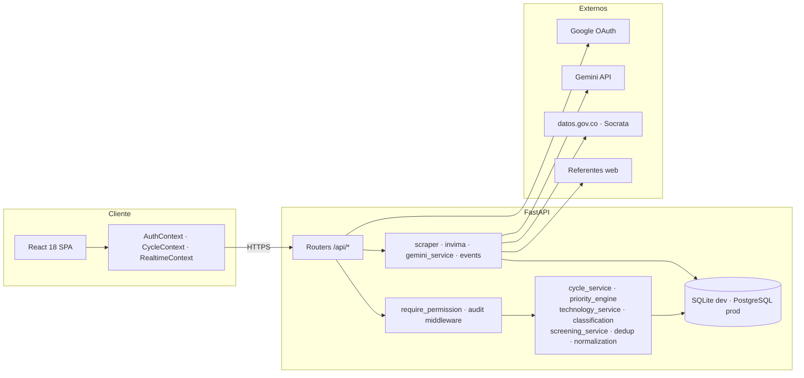

# Sistema de Escaneo de Horizonte del IETS

Plataforma web para el **escaneo de horizonte (horizon scanning)** del **Instituto de
Evaluación Tecnológica en Salud (IETS)** de Colombia: identificación temprana de
tecnologías sanitarias emergentes, vigilancia automatizada de referentes internacionales,
priorización según la matriz oficial del Manual Metodológico, caracterización técnica,
diseminación de informes asistida por IA y colaboración del equipo, todo bajo una
bitácora de auditoría inmutable.

Inspirado en el modelo operativo del
[NIHR Innovation Observatory](https://io.nihr.ac.uk/) y construido sobre la línea gráfica
corporativa definida en [`linea-grafica-y-ux-ui.md`](linea-grafica-y-ux-ui.md).

**Versión:** 6.1.0 · **Stack:** FastAPI + React 18 + SQLite (compatible con PostgreSQL 15)

> **v6.0 — Fases 0 a 6 del [plan de actualización](Plan_Fases_Actualizacion_Plataforma_EH_IETS.md).**
> El ciclo es el eje, la priorización usa la matriz P1–P6, la evaluación temprana
> tiene ficha/Mini-HTA y pares, y la cara visible ya está: tablero estratégico,
> ficha pública, boletín trimestral con aprobación y alertas en plataforma.
> El detalle de cumplimiento está en [`BACKLOG.md`](BACKLOG.md).

---

## Índice

- [Conceptos clave](#conceptos-clave)
- [Metodología y módulos](#metodología-y-módulos)
- [El ciclo operativo](#el-ciclo-operativo)
- [Filtrado, desduplicación e INVIMA](#filtrado-desduplicación-e-invima)
- [Matriz oficial de priorización %P](#matriz-oficial-de-priorización-p)
- [Perfiles y permisos](#perfiles-y-permisos)
- [Bitácora de auditoría](#bitácora-de-auditoría)
- [Catálogos y parámetros metodológicos](#catálogos-y-parámetros-metodológicos)
- [Arquitectura](#arquitectura)
- [Estructura del proyecto](#estructura-del-proyecto)
- [Modelo de datos](#modelo-de-datos)
- [API REST](#api-rest)
- [Puesta en marcha](#puesta-en-marcha)
- [Verificación](#verificación)
- [Configuración](#configuración-backendenv)
- [Migración desde versiones anteriores](#migración-desde-versiones-anteriores)
- [Flujo de uso sugerido](#flujo-de-uso-sugerido)
- [Documentación relacionada](#documentación-relacionada)

---

## Conceptos clave

Cuatro conceptos ordenan todo el sistema. Entenderlos evita la mayor parte de las dudas de operación.

**Señal (`Finding`).** Lo que la vigilancia extrae de un referente: un título, una URL y un texto. Es el registro de captura y no se descarta nunca.

**Tecnología (`Technology`).** La unidad metodológica: un medicamento, un dispositivo, un procedimiento. Persiste entre ciclos con su clúster, su tipología, sus fechas regulatorias y su identidad. Cada señal capturada origina una tecnología.

**Ciclo (`Cycle`).** La ventana de trabajo formal: entre 10 y 16 semanas, máximo tres al año. Tiene su propia máquina de estados y, al cerrarse, congela todo lo que contiene.

**Instancia por ciclo (`CycleTechnology`).** La evaluación de una tecnología *dentro de* un ciclo. Aquí viven el estado, el puntaje y la clasificación. Es lo que permite que una tecnología quede bajo vigilancia en el Ciclo I, se arrastre al Ciclo II y se reevalúe **sin sobrescribir** el registro anterior.

---

## Metodología y módulos

| Fase | Módulo | Ruta | Qué hace |
|---|---|---|---|
| **Operación** | Bandeja de trabajo | `/` | Indicadores del ciclo activo y cola de pendientes del perfil |
| **1. Identificación** | Vigilancia | `/vigilancia` | Conectores API (ClinicalTrials, FDA, EMA, PubMed) y HTML de último recurso, en cola |
| **Canal reactivo** | Postulación pública | `/postular` | Formulario externo con conflicto de interés; entra a moderación, no al catálogo |
| **Canal reactivo** | Postulaciones | `/postulaciones` | Cola de aceptación o rechazo; lo aceptado llega a la bandeja como reactivo |
| **1. Identificación** | Inventario | `/fuentes` | Catálogo verificado D-06: 53 fuentes, sonda de salud y panel de cobertura |
| **1. Identificación** | **Bandeja de entrada** | `/bandeja-entrada` | Staging: clasificar señales capturadas y asignarlas por lotes al ciclo |
| **Transversal** | **Ciclos** | `/ciclos` | Crear, transicionar y cerrar ciclos; embudo de conversión |
| **Filtrado** | **Filtrado y depuración** | `/filtrado` | Duplicados difusos, verificación de novedad, cruce INVIMA y Listado Único |
| **2. Priorización** | **Priorización oficial** | `/priorizacion` | Matriz P1–P6, cálculo de %P y clasificación en tres franjas |
| **2. Priorización** | Señales | `/senales` | Cola de cribado por `screening_score`, aún sin calificar |
| **5. Evaluación** | Evaluación temprana | `/evaluacion` | Ficha, informe o Mini-HTA; seis estados editoriales; COI bloqueante |
| **5. Evaluación** | Revisión por pares | `/revisar/:token` | Portal externo sin cuenta; token JWT de 10 días |
| **4. Diseminación** | Informes de adopción | `/diseminacion` | Recomendaciones para Colombia (IA o manual) |
| **4. Diseminación** | Notas | `/notas` | Anotaciones vinculadas a señales, fuentes e informes |
| **6. Diseminación** | Tablero estratégico | `/dashboards` | Cluster, TTM, embudo y calor presupuestal (restringido) |
| **6. Diseminación** | Ficha pública | `/expedientes` | Buscador y ficha sin autenticación |
| **6. Diseminación** | Boletines | `/boletines` | Compilación al cierre; aprobación del líder |
| **6. Diseminación** | Alertas | `/alertas` | Fase III en país y alto riesgo presupuestal |
| **Análisis** | Asistente IA | `/chat` | Chat con contexto sobre los datos del sistema |
| **Gobierno** | **Auditoría** | `/auditoria` | Bitácora inmutable con filtros y vida completa de cada entidad |
| **Admin** | Usuarios y perfiles | `/usuarios` | Perfiles RBAC y cuentas |
| **Admin** | Configuración | `/configuracion` | Gemini, catálogos y parámetros metodológicos |

**Rutas heredadas** (redirección automática): `/escaneo → /vigilancia`, `/hallazgos → /senales`, `/recomendaciones → /diseminacion`, `/caracterizacion → /evaluacion`.

> La antigua `/priorizacion` (lista de señales ordenada por heurística) vive ahora en `/senales`.
> La ruta liberada la ocupa la matriz oficial %P.

---

## El ciclo operativo

Todo el trabajo metodológico ocurre dentro de un ciclo. El selector del encabezado indica cuál está activo y contextualiza las vistas de priorización y caracterización.

### Reglas que el sistema hace cumplir

| Regla | Cómo se aplica |
|---|---|
| Máximo 3 ciclos formales por año calendario | Rechazo con HTTP 422 y mensaje explícito al crear el cuarto |
| Ventana de 10 a 16 semanas | Validada al crear y al editar, contra la fecha de boletín o de corte |
| Transiciones de estado predefinidas | Cualquier salto no contemplado responde 409 con las transiciones válidas |
| Solo el superadministrador cierra un ciclo | Permiso `cycle:close`, exclusivo de ese perfil |
| No se cierra con tecnologías en evaluación sin informe | Bloqueo, salvo justificación de cierre registrada en bitácora |
| Al cerrar, los puntajes se congelan | Todo intento posterior de calificar responde 409 |
| Lo que queda bajo vigilancia se arrastra | Nueva instancia en el ciclo destino, con el %P previo visible como referencia |

### Estados

```
En configuración → En filtrado → En priorización → En evaluación → Cerrado / consolidado
        ↑                ↓               ↓                ↓
        └────────────────┘───────────────┘────────────────┘   (retrocesos permitidos)
```

Los estados de la tecnología dentro del ciclo son: `capturada_no_asignada`, `asignada_a_ciclo`, `filtrada_apta_priorizacion`, `excluida`, `priorizada`, `bajo_vigilancia`, `no_priorizada`, `en_evaluacion` y `publicada`.

---

## Filtrado, desduplicación e INVIMA

Entre la asignación al ciclo y la matriz de priorización se interpone `/filtrado`. Su razón de ser es que **calificar una tecnología cuesta seis juicios humanos**: hacerlo sobre un duplicado, o sobre un genérico que nadie considera novedoso, desperdicia el recurso más escaso del proceso.

La pantalla tiene tres pestañas, en el orden en que conviene recorrerlas.

### Duplicados

El hash exacto solo atrapa la misma noticia repetida. La misma tecnología llega de tres referentes con tres nombres distintos, y esa es la que importa.

El barrido compara **nombre comercial, DCI, identificadores NCT y fabricante** con tres algoritmos que fallan de manera diferente:

| Algoritmo | Qué atrapa |
|---|---|
| Levenshtein | Erratas y transliteraciones: `Trastuzumab` frente a `Trastuzumap` |
| Jaro-Winkler | Coincidencia fuerte de prefijo, que es donde vive la raíz del principio activo |
| Token sort | Reordenamientos: `Anticuerpo anti-HER2 Roche` frente a `Roche anticuerpo anti-HER2` |

Tres reglas gobiernan el resultado:

- **Un NCT compartido es prueba, no indicio.** Dos registros que citan el mismo ensayo clínico son el mismo desarrollo, aunque los nombres no se parezcan en nada. La propuesta se marca como decisiva.
- **Un fabricante distinto desmiente la coincidencia de nombre.** Dos anticuerpos anti-HER2 de laboratorios distintos son competidores, no duplicados, y el motor exige una similitud mucho mayor antes de proponerlos.
- **El sistema nunca fusiona solo.** Deja una `MergeProposal` con su puntaje desglosado por algoritmo y espera confirmación. La fusión escribe `merged_into_id`, saca a la absorbida del Listado Único sin borrarla, y queda en la bitácora con actor y momento. Descartar también deja rastro: la próxima corrida no vuelve a proponer el par.

El umbral (`dedup.similarity_threshold`, defecto 85) es un parámetro editable. Bajarlo propone más pares y exige más revisión.

### Novedad y verificación regulatoria

Ninguna tecnología entra a la matriz `%P` sin que alguien declare **por qué es nueva**. La verificación vive por ciclo, no por tecnología: lo que era novedoso en el Ciclo I puede no serlo en el Ciclo II.

Cuatro vías la satisfacen:

| Vía | Cuándo aplica |
|---|---|
| No disponible en el país | Sin registro sanitario vigente en Colombia |
| Nueva indicación | Tecnología ya registrada que se propone para otra condición |
| Nueva forma farmacéutica | Cambio de vía o de presentación con impacto clínico |
| Nueva combinación | Asociación de principios activos ya existentes |

Y dos casos la niegan de forma explícita: **genéricos y biosimilares**, y **modificaciones menores** de presentación o empaque.

La compuerta es dura. `POST /technologies/{id}/cycles/{cid}/qualify` responde **409** si no hay verificación registrada o si la registrada no cumple, con el motivo en el cuerpo de la respuesta. La opción "otra" exige justificación escrita.

### El índice regulatorio vive en casa

La especificación pide que la verificación responda por debajo de 100 ms. Consultar datos.gov.co en cada cruce no lo permite, y la disponibilidad del dato abierto tampoco está garantizada, así que el sistema mantiene **una copia local** en `invima_records`, con las claves de búsqueda ya normalizadas.

Se alimenta por dos rutas:

- **`POST /api/invima/sync`** — descarga incremental desde los conjuntos Socrata de datos.gov.co. El sistema recorre varios conjuntos porque ninguno solo es suficiente, y registra cuáles respondieron y cuáles vinieron vacíos.
- **`POST /api/invima/sync/file`** — carga de un CSV o Excel descargado a mano. Es la ruta de contingencia prevista en el plan, y funciona sin conectividad hacia la fuente.

Cada sincronización queda en `invima_syncs` con su origen, filas ingresadas y resultado. **A los 30 días sin sincronizar, la pantalla muestra una alerta de obsolescencia**, porque un filtro regulatorio desactualizado produce falsos negativos silenciosos: dice que algo no está registrado cuando sí lo está.

> **Limitación conocida.** El conjunto del CUM (`i7cb-raxc`) publica cero filas al momento de esta versión, y ninguno de los conjuntos disponibles expone el principio activo, solo el nombre del producto. La verificación por DCI queda degradada hasta que se resuelva la decisión **D-04**. El sistema funciona con lo que hay y lo dice en la interfaz en lugar de aparentar una cobertura que no tiene.

### Listado Único por clúster

Lo que sobrevive al filtro se consolida en `GET /api/screening/unique-list/{ciclo}`: agrupado por clúster, con conteos, exportable a CSV y congelado al cerrar el ciclo. Es la vista que se publica y la que alimenta la matriz de priorización.

### Normalización de vocabularios

`POST /api/screening/normalize/{id}` canoniza los códigos antes de compararlos: **ATC** con validación de su estructura jerárquica, **CIE-10** en formato de punto, **MeSH** y la nomenclatura de dispositivos **GMDN/EMDN**. Cuando falta un código, el sistema propone candidatos a partir del clúster asignado, como sugerencia visible que confirma una persona.

---

## Matriz oficial de priorización %P

Seis criterios binarios del Manual Metodológico. **`%P = (suma de puntos / 6) × 100`.**

| Criterio | Pregunta | Quién califica | Pre-llenado |
|:---:|---|---|:---:|
| **P1** | ¿La tecnología es nueva, es decir, no está disponible en el país? | Evaluador técnico | Sí |
| **P2** | ¿La condición es relevante por alta mortalidad, morbilidad o deterioro grave de la calidad de vida? | Evaluador clínico | — |
| **P3** | ¿La condición representa alta carga de enfermedad o impacto financiero sustancial para el SGSSS? | Evaluador clínico | — |
| **P4** | ¿Se anticipa un impacto organizacional importante: cambio de ruta clínica, infraestructura o entrenamiento complejo? | Evaluador clínico *(decisión abierta)* | — |
| **P5** | ¿Ha sido aprobada por EMA o FDA en los últimos 12 meses o menos? | Evaluador técnico | Sí |
| **P6** | ¿Está bajo proceso formal de evaluación regulatoria en agencias de referencia, en 6 meses o menos? | Evaluador técnico | Sí |

### Clasificación

| Puntos | %P | Resultado |
|:---:|:---:|---|
| 4 a 6 | 66,67 a 100 | **Priorizada** |
| 3 | 50,00 | **Bajo vigilancia** — se arrastra al ciclo siguiente |
| 0 a 2 | 0 a 33,33 | **No priorizada** |

### Garantías del motor

- **El `%P` no existe hasta que existen los seis criterios.** Mientras falte uno, la API devuelve `priority_pct: null` y la lista de faltantes; la interfaz no muestra ningún porcentaje.
- **Permisos por campo.** Un evaluador clínico que intente calificar P1, P5 o P6 recibe 403, y el intento queda registrado.
- **Sugerencias, no decisiones.** El pre-llenado de P1, P5 y P6 se calcula desde las fechas de aprobación FDA y EMA, el registro INVIMA y el estado regulatorio, y se presenta con su motivo visible. El evaluador confirma o corrige; nunca se aplica solo.
- **Enunciados versionados.** Las preguntas viven en base de datos con número de versión. Un ajuste del Manual no obliga a desplegar, y cada calificación conserva la versión del enunciado bajo el que se emitió.
- **Umbrales parametrizables.** `priority.points_prioritized` y `priority.points_watch` se editan en caliente.

### Sobre el puntaje anterior

El antiguo `priority_score` (heurística 0–100, umbral 70 %) se renombró a **`screening_score`** y quedó confinado a ordenar la cola de señales aún no calificadas en `/senales`. **Ya no gobierna transiciones de estado ni se presenta como puntaje de priorización.** Las dos escalas no son comparables: los tableros históricos corresponden al modelo anterior.

---

## Perfiles y permisos

Cinco perfiles con permisos declarativos por módulo y, en la matriz de priorización, por criterio.

| Perfil | Alcance |
|---|---|
| **Superadministrador** | Todo: cierre de ciclos, catálogos, usuarios, configuración y bitácora |
| **Evaluador técnico** | Vigilancia, staging, tecnologías, ciclos, filtrado, sincronización de INVIMA e informes; califica **P1, P5 y P6** |
| **Evaluador clínico** | Vigilancia, staging, tecnologías, filtrado e informes; califica **P2, P3 y P4** |
| **Tomador de decisiones** | Consulta y tableros restringidos; puede escribir notas |
| **Revisor por pares** | Consulta y envío de revisiones; el experto externo entra por token, sin cuenta permanente |

La matriz completa de los 20 permisos está en [`BACKLOG.md`](BACKLOG.md#matriz-rbac-de-cinco-perfiles) y su fuente de verdad en [`backend/app/rbac.py`](backend/app/rbac.py).

**Migración automática de roles heredados** al arrancar: `admin → superadmin`, `editor → evaluador_tecnico`, `viewer → tomador_decisiones`. Los perfiles `evaluador_clinico` y `revisor_pares` requieren alta manual desde `/usuarios`.

El frontend no reimplementa la autorización: `GET /api/auth/me` devuelve `permissions` y `rateable_criteria`, y la interfaz se dibuja a partir de esa respuesta.

---

## Bitácora de auditoría

Toda creación, modificación y borrado sobre las entidades sensibles queda registrado con **usuario, correo, IP, ruta, identificador de petición, valor anterior y valor nuevo**.

El registro ocurre por dos caminos complementarios, de modo que ningún camino de código pueda saltárselo:

1. Un listener `after_flush` de SQLAlchemy que captura los cambios del ORM automáticamente.
2. `record_action()` para eventos de negocio que no se reducen a un cambio de fila: cierre de ciclo, arrastre entre ciclos, asignación por lotes, clasificación de priorización e intentos de acceso denegados.

**La tabla es append-only a nivel de motor:** triggers que abortan `UPDATE` y `DELETE` en SQLite, `REVOKE` de esos privilegios al usuario de aplicación en PostgreSQL.

Los campos `raw_content`, `raw_payload` y `picture` nunca se copian a la bitácora, por ruido o por ser dato sensible.

Consulta en `/auditoria` con filtros por entidad, acción y usuario, más la reconstrucción cronológica completa de cualquier entidad.

---

## Catálogos y parámetros metodológicos

La especificación advierte que las taxonomías pueden cambiar tras la referenciación, así que **se cargan como dato editable, nunca como enumeración en código**.

**6 clústeres de salud:** cáncer · enfermedades de alto costo · enfermedades huérfanas o raras · Covid-19 y otras infecciosas emergentes · enfermedades prevalentes · otras categorías sanitarias prioritarias.

**7 tipologías tecnológicas:** medicamento químico o biológico · terapias avanzadas y génicas · dispositivos médicos · equipos y reactivos de diagnóstico in vitro · procedimientos quirúrgicos y nuevas técnicas clínicas · salud digital · algoritmos y sistemas de inteligencia artificial.

Cada clúster lleva sus palabras clave, prefijos CIE-10 y términos MeSH, que alimentan el **clasificador asistido**: al abrir una señal en la bandeja de entrada, el sistema propone clúster, tipología y condición con su justificación. La propuesta siempre la confirma una persona.

**Condición de la tecnología** (glosario de la especificación), obligatoria y distinta del horizonte heredado, con el que convive:

- **Emergente** — en fases clínicas avanzadas (II o III), previa a la aprobación regulatoria.
- **Nueva** — aprobada en agencia de referencia hace 12 meses o menos, sin adopción formal en el SGSSS.

**Parámetros editables en caliente** desde la pestaña *Gobierno metodológico* de `/configuracion`, o con `PUT /api/methodology/params/{key}`:

| Clave | Defecto | Gobierna |
|---|:---:|---|
| `cycle.max_per_year` | 3 | Ciclos formales por año |
| `cycle.window_weeks_min` | 10 | Ventana mínima, en semanas |
| `cycle.window_weeks_max` | 16 | Ventana máxima, en semanas |
| `priority.points_prioritized` | 4 | Umbral de priorizada |
| `priority.points_watch` | 3 | Umbral de bajo vigilancia |
| `priority.criteria_total` | 6 | Denominador del `%P` |
| `priority.threshold_pct_label` | 70 | Porcentaje de referencia que se muestra, sin efecto sobre la clasificación |
| `dedup.similarity_threshold` | 85 | Similitud mínima para proponer una fusión de duplicados |
| `invima.match_threshold` | 88 | Similitud mínima para dar por hallado un registro sanitario |
| `evaluation.mini_hta_min_points` | 6 | Puntos para sugerir Mini-HTA (D-07/D-09, sobreescribible) |
| `evaluation.informe_min_points` | 5 | Puntos para sugerir informe; por debajo, ficha |
| `evaluation.reviewer_token_days` | 10 | Vigencia del JWT del revisor externo |
| `ttm.inminente_months_max` | 12 | Tope de meses para TTM inminente (D-10) |
| `ttm.transicion_months_max` | 24 | Tope de meses para TTM en transición |
| `ttm.emergente_months_max` | 36 | Tope de meses para TTM emergente |
| `ttm.regulatory_review_days` | 180 | Plazo de revisión que se suma al cierre de fase III |
| `alerts.high_budget_points` | 5 | Umbral de alto riesgo presupuestal para alertas |
| `alerts.phase3_country_tokens` | colombia,… | Tokens que señalan un ensayo fase III en el país |

Todo cambio de parámetro queda en la bitácora, con autor, momento y valor anterior. Los ciclos ya cerrados conservan congelado el resultado que obtuvieron bajo los valores previos.

**Ninguna perilla es decorativa.** Un parámetro editable que ningún cálculo lee es peor que no tenerlo, porque invita a ajustarlo y a creer que surtió efecto. Una prueba recorre el paquete completo y falla si alguna clave sembrada no tiene consumidor en el código.

---

## Arquitectura



| Capa | Tecnología |
|---|---|
| Backend | FastAPI 0.115 · SQLAlchemy 2 · Pydantic 2 |
| Datos | SQLite en desarrollo · PostgreSQL 15 en producción (`pg_trgm`, `unaccent`, JSONB) |
| Scraping | httpx · trafilatura · BeautifulSoup (lxml) · pypdf |
| Similitud difusa | RapidFuzz (Levenshtein, Jaro-Winkler, token sort) |
| IA | google-generativeai (Gemini, con autodetección de modelo) |
| Auth | Google Identity Services · JWT (python-jose) |
| Frontend | React 18 · Vite 5 · React Router 6 · Recharts · axios |

El código es **agnóstico del motor de base de datos**: el tipo `JSONType` resuelve a JSONB en PostgreSQL y a JSON en SQLite, y el endurecimiento de la bitácora aplica la estrategia de cada motor.

Diagramas detallados (flujos, ER, máquinas de estados, secuencias, despliegue): ver [`BACKLOG.md`](BACKLOG.md).

---

## Estructura del proyecto

```
Sis_HS_IETS/
├── backend/
│   ├── app/
│   │   ├── main.py                 # FastAPI + SPA estática + middleware de auditoría
│   │   ├── models.py               # ORM completo
│   │   ├── database.py             # Conexión, migraciones ligeras, endurecimiento
│   │   ├── audit.py                # Bitácora inmutable (listener + contexto)
│   │   ├── rbac.py                 # Cinco perfiles y permisos declarativos
│   │   ├── deps.py                 # require_permission, usuario actual
│   │   ├── methodology.py          # Catálogos, estados y parámetros
│   │   ├── cycle_service.py        # Máquina de estados y reglas del ciclo
│   │   ├── priority_engine.py      # Matriz oficial P1–P6
│   │   ├── priority.py             # screening_score (cola de cribado)
│   │   ├── technology_service.py   # Finding → Technology y ciclo histórico
│   │   ├── classification.py       # Sugerencia de clúster, tipología y condición
│   │   ├── screening_service.py    # Fusión, novedad, compuerta y Listado Único
│   │   ├── dedup.py                # Motor difuso RapidFuzz
│   │   ├── normalization.py        # ATC, CIE-10, MeSH, GMDN/EMDN
│   │   ├── invima.py               # Índice local: Socrata y carga plana
│   │   ├── scraper.py              # Pipeline de vigilancia
│   │   ├── gemini_service.py       # Integración IA
│   │   ├── seed_data.py            # 29 referentes iniciales
│   │   └── routers/                # auth, cycles, technologies, priority,
│   │                               # screening, invima, catalogs, audit, …
│   ├── tests/                      # 134 pruebas unitarias
│   ├── smoke_test.py               # Suite de regresión E2E (63 verificaciones)
│   ├── requirements.txt
│   └── .env.example
├── frontend/
│   ├── src/
│   │   ├── pages/                  # Cycles, Staging, Screening, Prioritization, Audit, …
│   │   ├── components/             # PriorityMatrix, TriageBoard, Layout, …
│   │   ├── cycle/CycleContext.jsx  # Ciclo activo persistente
│   │   ├── auth/AuthContext.jsx    # JWT y permisos
│   │   ├── realtime/               # Polling de state_version
│   │   └── constants/methodology.js
│   └── dist/                       # Build servido por FastAPI en producción
├── start.ps1                       # Arranque rápido en Windows
├── Plan_Fases_Actualizacion_Plataforma_EH_IETS.md
├── BACKLOG.md                      # Trazabilidad RF, diagramas y roadmap
├── linea-grafica-y-ux-ui.md        # Design system
└── README.md
```

---

## Modelo de datos

### Filtrado y depuración (v3.0)

| Entidad | Descripción |
|---|---|
| `MergeProposal` | Par candidato a fusión, con puntaje desglosado por algoritmo, estado y resolución humana |
| `NoveltyAssessment` | Verificación de novedad por ciclo: vía elegida, justificación y resultado del cruce INVIMA |
| `InvimaRecord` | Copia local del registro sanitario, con claves de búsqueda precalculadas |
| `InvimaSync` | Bitácora de cada sincronización: origen, filas, resultado y quién la disparó |

`Technology.merged_into_id` apunta a la tecnología que absorbió a esta. La fusión nunca borra: la absorbida sale del Listado Único y conserva su historia.

### Núcleo metodológico (v2.0)

| Entidad | Descripción |
|---|---|
| `Cycle` | Ciclo operativo: código, ventana, estado, cierre y bandera de histórico |
| `Technology` | Unidad metodológica persistente: identidad, clasificación, fechas regulatorias, `raw_payload` |
| `CycleTechnology` | Instancia de una tecnología en un ciclo: estado, `%P`, puntos, congelación, arrastre |
| `PriorityCriterion` | Enunciados P1–P6 versionados, con su ámbito de rol y bandera de pre-llenado |
| `PriorityScore` | Calificación individual: valor binario, sugerencia, justificación, autor y momento |
| `Cluster` | Clúster de salud con palabras clave, prefijos CIE-10 y términos MeSH |
| `TechType` | Tipología tecnológica con mapeo de los tipos heredados |
| `MethodologyParam` | Parámetro metodológico editable en caliente |
| `AuditLog` | Bitácora append-only |
| `EvaluationDoc` | Expediente editorial: nivel de producto, seis estados, cuerpo estructurado |
| `EvaluationVersion` | Instantánea en cada guardado y transición |
| `ReviewAssignment` | Revisor interno o externo; COI y token de 10 días |
| `ReviewComment` | Observación anclada a campo y versión |

### Entidades heredadas

| Entidad | Descripción |
|---|---|
| `User` | Cuenta institucional con uno de los cinco perfiles |
| `Source` | Referente del inventario |
| `Finding` | Señal capturada; conserva `screening_score` y `content_hash` |
| `Recommendation` | Informe de adopción vinculado a una señal |
| `ScrapeLog` | Registro de cada ejecución de vigilancia |
| `Note` | Nota del equipo |
| `ChatSession` / `ChatMessage` | Historial del asistente IA |
| `AppMeta` | Configuración runtime y `state_version` para tiempo real |

`PriorityScore` es único por `(cycle_id, technology_id, criterion)`. Recalificar en un ciclo posterior crea filas nuevas; jamás modifica las congeladas.

---

## API REST

Documentación interactiva: **`http://127.0.0.1:8000/docs`**

### Filtrado y depuración

| Prefijo | Endpoints principales |
|---|---|
| `/api/screening` | `POST /merges/scan`, `GET /merges`, `POST /merges/{id}/confirm` · `/discard`, `GET /novelty/options`, `GET`·`PUT /novelty/{cid}/{tid}`, `POST /novelty/{cid}/{tid}/invima-check`, `POST /normalize/{id}`, `GET /unique-list/{cid}` · `/export`, `GET /stats` |
| `/api/invima` | `GET /status`, `GET /syncs`, `GET /search`, `POST /sync`, `POST /sync/file` |

### Núcleo metodológico

| Prefijo | Endpoints principales |
|---|---|
| `/api/cycles` | CRUD, `GET /active`, `GET /{id}/close-check`, `PUT /{id}/status`, `POST /{id}/carry-over` |
| `/api/technologies` | `GET /staging`, `GET /staging/stats`, `POST /assign-to-cycle`, `POST /{id}/suggest-classification`, `POST /{id}/cycles/{cid}/qualify` · `/exclude` · `/to-evaluation` |
| `/api/priority` | `GET /criteria`, `GET /{cid}/{tid}`, `POST /{cid}/{tid}/rate`, `GET /{cid}/queue`, `GET /{cid}/stats` |
| `/api/clusters` · `/api/tech-types` | Catálogos parametrizables (CRUD) |
| `/api/methodology` | `GET /params`, `PUT /params/{key}`, `GET /enums` |
| `/api/audit` | `GET /`, `GET /entity/{tipo}/{id}`, `GET /actions` |
| `/api/reports` | Cola, CRUD de fichas, COI, transiciones, invitaciones, versiones, export HTML |
| `/api/public/reviews` | Portal del revisor: lectura condicionada a COI, comentarios y veredicto |
| `/api/strategy` | Tablero estratégico, datamart y capa restringida |
| `/api/bulletins` | Compilar, aprobar, publicar y exportar el boletín |
| `/api/alerts` | Bandeja y suscripciones |
| `/api/public/strategy/stats` · `/api/public/technologies` | Transparencia y fichas públicas |

### Operación heredada

| Prefijo | Endpoints principales |
|---|---|
| `/api/health` · `/api/status` | Estado del servicio |
| `/api/auth` | `POST /google`, `POST /dev-login`, `GET /me` |
| `/api/sources` | CRUD, categorías, export CSV, alta rápida |
| `/api/scan` | `POST /run`, `POST /source/{id}`, `POST /preview`, `GET /logs` |
| `/api/ingest` | `POST /run`, `GET /jobs`, `GET /connectors`, `POST /sources/import`, `POST /sources/{id}/probe`, `GET /health`, `GET /coverage` |
| `/api/findings` | CRUD, filtros, `POST /{id}/enhance-ai` |
| `/api/recommendations` | CRUD, `POST /generate` (Gemini) |
| `/api/dashboard` | `GET /stats`, `GET /workbench` |
| `/api/notes` | CRUD, export CSV, `POST /{id}/enhance-ai` |
| `/api/chat` | Sesiones, `POST /send` |
| `/api/users` | Listado, `GET /roles`, cambio de perfil, activación |
| `/api/config` | Configuración Gemini |
| `/api/realtime/version` | Versión de estado para sincronización |

**Cambio incompatible respecto a la v1:** `Finding.priority_score` se llama ahora `Finding.screening_score` en todas las respuestas. `UserOut` incorpora `role_label`, `permissions` y `rateable_criteria`.

**Cambio de comportamiento en la v3:** `POST /api/technologies/{id}/cycles/{cid}/qualify` ya no depende solo del permiso. Responde **409** si la tecnología no tiene verificación de novedad registrada en ese ciclo, o si la registrada corresponde a un genérico o a una modificación menor. El cuerpo de la respuesta trae el motivo.

---

## Puesta en marcha

### Arranque rápido (Windows)

Desde la raíz del repositorio:

```powershell
.\start.ps1
```

El script crea el entorno virtual e instala dependencias, copia `.env.example` a `.env` si no existe, compila el frontend si falta `frontend/dist` y levanta el servidor en **http://127.0.0.1:8000** con la API y la SPA.

### Backend manual

```powershell
cd backend
python -m venv .venv
.\.venv\Scripts\Activate.ps1
pip install -r requirements.txt
copy .env.example .env      # edite los valores
python -m uvicorn app.main:app --reload --port 8000
```

Al iniciar, el backend ejecuta en orden:

1. Creación de tablas y extensiones de PostgreSQL cuando aplica
2. Migraciones ligeras de esquema, incluida la de `priority_score` a `screening_score`
3. Endurecimiento de la bitácora (triggers o `REVOKE` según el motor)
4. Instalación de los listeners de auditoría
5. Sincronización del catálogo verificado D-06 (53 fuentes; retira el inventario anterior sin borrar senales)
6. Siembra de clústeres, tipologías, criterios P1–P6 y parámetros metodológicos
7. Recálculo de `screening_score` en las señales existentes
8. Migración de señales a tecnologías y creación del Ciclo 0 - Histórico

Todos los pasos son **idempotentes**: reiniciar no duplica nada.

### Frontend con recarga en caliente

```powershell
# Terminal 1 — backend
cd backend
.\.venv\Scripts\Activate.ps1
python -m uvicorn app.main:app --reload --port 8000

# Terminal 2 — frontend
cd frontend
npm install
npm run dev        # http://localhost:5173
```

### Producción

```powershell
cd frontend
npm install
npm run build      # genera frontend/dist
```

Con `frontend/dist` presente, **solo hace falta el backend**: sirve la SPA en `/` y la API en `/api/*`.

---

## Verificación

### Pruebas unitarias

```powershell
cd backend
.\.venv\Scripts\python.exe -m pytest -q
```

134 pruebas sobre el motor de priorización, la máquina de estados del ciclo, el RBAC, los catálogos, el filtrado, la evaluación temprana (COI, seis estados, Mini-HTA y token de revisor) y la bitácora.

### Suite de regresión de extremo a extremo

Con el servidor en marcha:

```powershell
cd backend
.\.venv\Scripts\python.exe smoke_test.py
.\.venv\Scripts\python.exe smoke_test.py --base http://127.0.0.1:8000 --skip-network
```

63 verificaciones agrupadas por fase:

- **Disponibilidad** — health y status.
- **Fase 0** — dev-login, matriz de permisos, catálogo de los cinco perfiles.
- **Operación heredada** — fuentes, señales, notas, recomendaciones, escaneos, tableros, exportaciones y CRUD de nota.
- **Fase 1, catálogos** — 6 clústeres, 7 tipologías, parámetros y estados.
- **Fase 1, ciclo** — rechazo de ventana corta, creación válida, rechazo de transición inválida, recorrido hasta priorización.
- **Fase 1, staging** — bandeja, bloqueo de asignación sin clasificar, clasificación y asignación.
- **Fase 3, filtrado** — rechazo de calificar sin verificación de novedad, barrido de duplicados, carga del índice de INVIMA por archivo plano, verificación de que la búsqueda responde por debajo de 100 ms, cruce regulatorio, rechazo de la opción "otra" sin justificación, guardado de la verificación, calificación que ahora sí pasa la compuerta, Listado Único por clúster y su exportación.
- **Fase 2, motor %P** — matriz versionada, pre-llenado, no cálculo con criterios pendientes, rechazo de valor no binario, verificación de que 4 puntos dan 66,67 % y clasifican como priorizada, cola y contadores.
- **Fase 5, evaluación** — apertura de ficha, COI bloqueante, envío a revisión interna, rechazo de publicar sin revisor externo, portal con COI, HTML institucional, token caducado.
- **Fase 2, congelación** — cierre del ciclo y rechazo de calificar lo congelado.
- **Fase 0, bitácora** — registro de creación, transición y cierre; atribución de cada escritura al usuario real, con IP y ruta, rechazando cualquier registro anónimo; reconstrucción de la vida completa del ciclo; trazabilidad de los cambios de parámetros metodológicos.

La carga del índice de INVIMA usa el archivo plano y no la red, para que la suite sea reproducible sin depender de la disponibilidad de datos.gov.co.

La suite eleva temporalmente la cuota anual de ciclos y la restaura al terminar, para no agotarla entre corridas.

### Build del frontend

```powershell
cd frontend
npm run build
```

---

## Configuración (`backend/.env`)

Copie [`backend/.env.example`](backend/.env.example) como `.env`.

| Variable | Descripción |
|---|---|
| `SECRET_KEY` | Clave para firmar JWT (cámbiela en producción) |
| `ACCESS_TOKEN_EXPIRE_MINUTES` | Duración del token (defecto 720 min) |
| `GOOGLE_CLIENT_ID` | Client ID OAuth 2.0 para el login institucional |
| `ALLOWED_EMAIL_DOMAIN` | Dominio permitido (defecto `iets.org.co`) |
| `ADMIN_EMAILS` | Correos que reciben el perfil de superadministrador al primer login |
| `ALLOW_DEV_LOGIN` | Login sin Google. **`false` en producción**: el intento denegado queda en bitácora |
| `GEMINI_API_KEY` | API key de [Google AI Studio](https://aistudio.google.com/app/apikey) |
| `GEMINI_MODEL` | Opcional; vacío activa la autodetección |
| `CORS_ORIGINS` | Orígenes del frontend, separados por coma |
| `DATABASE_URL` | Defecto `sqlite:///./iets_horizonte.db`; acepta `postgresql+psycopg://…` |

**Login con Google:** cree credenciales OAuth 2.0 de tipo "Aplicación web" en Google Cloud Console y agregue el origen del frontend a "Orígenes autorizados de JavaScript".

**Sin `GOOGLE_CLIENT_ID`:** use el acceso rápido de la pantalla de login o `POST /api/auth/dev-login` con un correo `@iets.org.co`.

La configuración de Gemini también puede guardarse desde `/configuracion` y tiene prioridad sobre el `.env`.

---

## Migración desde versiones anteriores

La actualización es **automática e idempotente**: basta arrancar el backend sobre la base existente. No hay pasos manuales ni pérdida de datos.

### Desde la v1

| Qué pasa | Detalle |
|---|---|
| `priority_score` → `screening_score` | Renombrado de columna preservando los valores; en SQLite antiguo se recrea la tabla |
| Roles heredados | `admin → superadmin`, `editor → evaluador_tecnico`, `viewer → tomador_decisiones` |
| Señales existentes | Cada `Finding` genera una `Technology` con `raw_payload` reconstruido y clasificación sugerida |
| Señales ya trabajadas | Se asocian a un **Ciclo 0 - Histórico** cerrado, que nunca contamina los indicadores de los ciclos formales |
| Enlaces guardados | Las rutas heredadas siguen redirigiendo |
| Código de terceros | `require_role` se conserva como envoltorio sobre `require_permission` |

Tras migrar, revise en `/usuarios` quién debe pasar de evaluador técnico a **evaluador clínico**: el mapeo automático no puede inferirlo y sin ese perfil nadie podrá calificar P2, P3 y P4.

### Desde la v2

| Qué pasa | Detalle |
|---|---|
| Tablas nuevas | `merge_proposals`, `novelty_assessments`, `invima_records` e `invima_syncs` se crean vacías |
| `Technology.merged_into_id` | La migración la agrega si falta, nula en todo lo existente. `create_all` no altera tablas ya creadas, así que hace falta el paso explícito |
| Parámetros nuevos | `dedup.similarity_threshold` e `invima.match_threshold` se siembran con sus valores por defecto |
| Permiso nuevo | `invima:sync` se concede al superadministrador y al evaluador técnico |
| Ciclos ya abiertos | Las tecnologías asignadas quedan **sin verificación de novedad**, así que calificarlas responderá 409 hasta que alguien la registre en `/filtrado` |

El último punto es el único que cambia la operación de un ciclo en curso. Si prefiere terminar el ciclo abierto con las reglas de la v2, ciérrelo antes de actualizar.

**Se recomienda respaldar `backend/iets_horizonte.db` antes de cada actualización mayor.**

**Primer arranque de la v3:** vaya a `/filtrado`, pestaña *Novedad*, y sincronice el índice de INVIMA. Sin él, el cruce regulatorio no devuelve nada y la pantalla lo advierte.

---

## Flujo de uso sugerido

1. **Iniciar sesión** — Google institucional o acceso de desarrollo.
2. **Abrir un ciclo** en `/ciclos`: código, apertura, corte de datos y fecha de boletín. El sistema valida la ventana y la cuota anual.
3. **Vigilancia** — ejecutar el rastreo masivo o por referente.
4. **Bandeja de entrada** — clasificar las señales capturadas (clúster, tipología, condición, fechas regulatorias) apoyándose en la sugerencia asistida, y asignarlas por lotes al ciclo. Sin clúster ni tipología, el sistema no permite asignar.
5. **Filtrado** — pasar el ciclo a *En filtrado* e ir a `/filtrado`: correr el barrido de duplicados y resolver las propuestas, declarar la novedad de cada tecnología con su cruce contra INVIMA, y revisar el Listado Único que resulta. Lo que no supere la compuerta de novedad no llega a la matriz.
6. **Priorización** — pasar a *En priorización*. Cada perfil ve en `/priorizacion` solo lo que le corresponde calificar. Al completarse los seis criterios, el sistema calcula el `%P` y clasifica.
7. **Caracterización y diseminación** — enviar las priorizadas a evaluación, completar las fichas y generar los informes.
8. **Cierre** — pasar a *En evaluación* y cerrar. Se congelan los puntajes y lo que quedó bajo vigilancia se propone para el ciclo siguiente.
9. **Auditoría** — en `/auditoria`, reconstruir la vida completa de cualquier ciclo, tecnología o calificación.

---

## Documentación relacionada

| Documento | Contenido |
|---|---|
| [`Plan_Fases_Actualizacion_Plataforma_EH_IETS.md`](Plan_Fases_Actualizacion_Plataforma_EH_IETS.md) | Plan de fases 0 a 7 y matriz de trazabilidad de los 20 RF |
| [`BACKLOG.md`](BACKLOG.md) | Estado de cumplimiento por RF, diagramas, roadmap, riesgos y decisiones abiertas |
| [`Catalogo_Fuentes_Proactivas_Verificadas_EH_IETS.md`](Catalogo_Fuentes_Proactivas_Verificadas_EH_IETS.md) | Inventario definitivo RF01 / D-06 y contrato de cada conector |
| [`linea-grafica-y-ux-ui.md`](linea-grafica-y-ux-ui.md) | Paleta, tipografía y componentes de interfaz |
| [`backend/app/methodology.py`](backend/app/methodology.py) | Catálogos, estados y parámetros metodológicos |
| [`backend/app/priority_engine.py`](backend/app/priority_engine.py) | Motor oficial %P |
| [`backend/app/screening_service.py`](backend/app/screening_service.py) | Fusión de duplicados, compuerta de novedad y Listado Único |
| [`backend/app/dedup.py`](backend/app/dedup.py) | Motor difuso y sus umbrales calibrados |
| [`backend/app/invima.py`](backend/app/invima.py) | Índice local del registro sanitario |
| [`backend/app/rbac.py`](backend/app/rbac.py) | Matriz de permisos por módulo y por campo |
| [`backend/smoke_test.py`](backend/smoke_test.py) | Suite de regresión de extremo a extremo |

**Siguiente fase:** la 5 (evaluación temprana, Mini-HTA y revisión por pares). Su alcance y las decisiones D-07 a D-09 y D-12 están en [`BACKLOG.md`](BACKLOG.md#backlog-priorizado).
